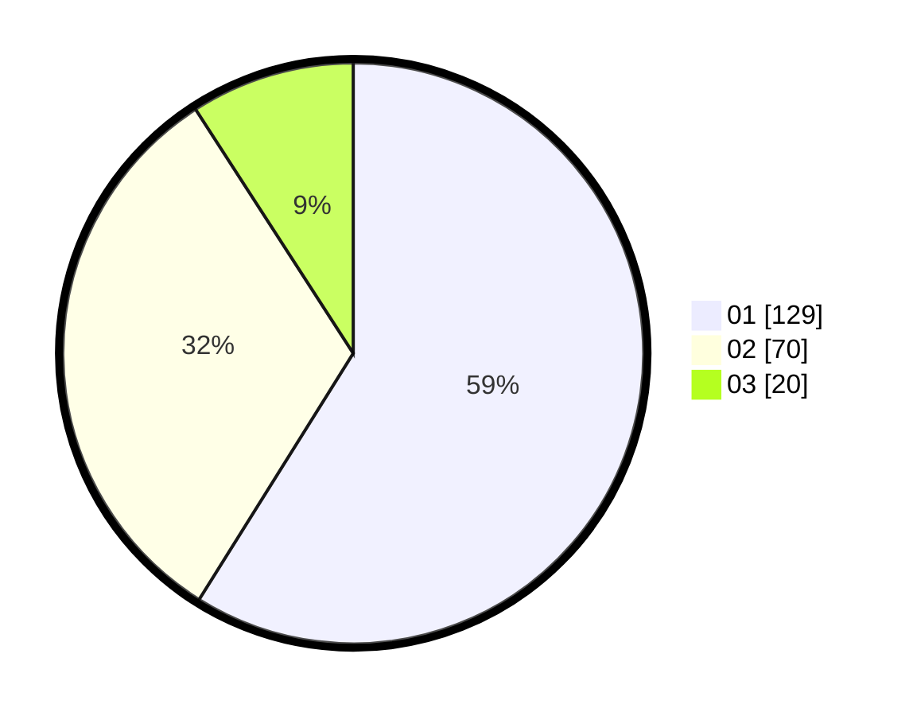

# Hasil

Hasil perolehan suara paslon dapat dilihat pada file paslon-01.txt, paslon-02.txt, dan paslon-03.txt.

Jika tidak ada, artinya data tersebut belum ada pada SIREKAP.

## Perolehan Suara

 * Paslon 01: **129**.
 * Paslon 02: **70**.
 * Paslon 03: **20**.

## Foto C Plano

https://sirekap-obj-formc.kpu.go.id/e70a/pemilu/ppwp/31/75/07/10/01/3175071001170-20240215-004045--5f621685-a0c2-4059-a3a9-d6b390cff986.jpg

https://sirekap-obj-formc.kpu.go.id/e70a/pemilu/ppwp/31/75/07/10/01/3175071001170-20240215-010721--24e44c8e-90b9-4906-b120-40d3a9f54d28.jpg

https://sirekap-obj-formc.kpu.go.id/e70a/pemilu/ppwp/31/75/07/10/01/3175071001170-20240215-010902--8aada2cd-ecb6-4305-8990-7c7805549288.jpg
