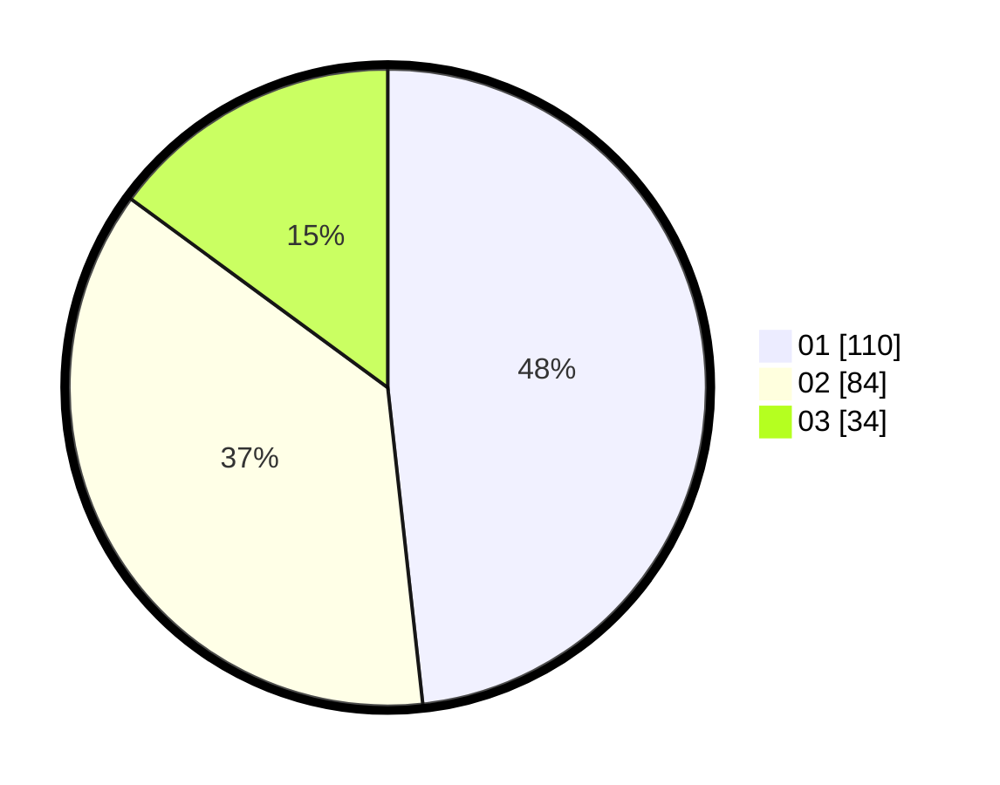

# Hasil

Hasil perolehan suara paslon dapat dilihat pada file paslon-01.txt, paslon-02.txt, dan paslon-03.txt.

Jika tidak ada, artinya data tersebut belum ada pada SIREKAP.

## Perolehan Suara

 * Paslon 01: **110**.
 * Paslon 02: **84**.
 * Paslon 03: **34**.

## Foto C Plano

https://sirekap-obj-formc.kpu.go.id/4608/pemilu/ppwp/31/75/07/10/01/3175071001175-20240216-020259--1ff80750-e7ad-4fa1-aab8-7b991833aa3b.jpg

https://sirekap-obj-formc.kpu.go.id/4608/pemilu/ppwp/31/75/07/10/01/3175071001175-20240216-020307--0e8897d3-3e18-4ee0-ad1f-173abeee56b3.jpg

https://sirekap-obj-formc.kpu.go.id/4608/pemilu/ppwp/31/75/07/10/01/3175071001175-20240216-020305--a05a74aa-c201-4e71-91cd-e62c002b1753.jpg

## DATA PEMILIH TETAP

Jumlah pemilih dalam DPT: **229**.
 * L: **103**.
 * P: **126**.

## DATA PENGGUNA HAK PILIH

Jumlah pengguna hak pilih dalam DPT: **227**.
 * L: **103**.
 * P: **124**.

Jumlah pengguna hak pilih dalam DPTb: **2**.
 * L: **0**.
 * P: **2**.

Jumlah pengguna hak pilih dalam DPK: **0**.
 * L: **0**.
 * P: **0**.

Jumlah pengguna hak pilih: **229**.
 * L: **103**.
 * P: **126**.

## JUMLAH SUARA SAH DAN TIDAK SAH

JUMLAH SELURUH SUARA SAH: **228**.

JUMLAH SUARA TIDAK SAH: **1**.

JUMLAH SELURUH SUARA SAH DAN SUARA TIDAK SAH: **229**.
