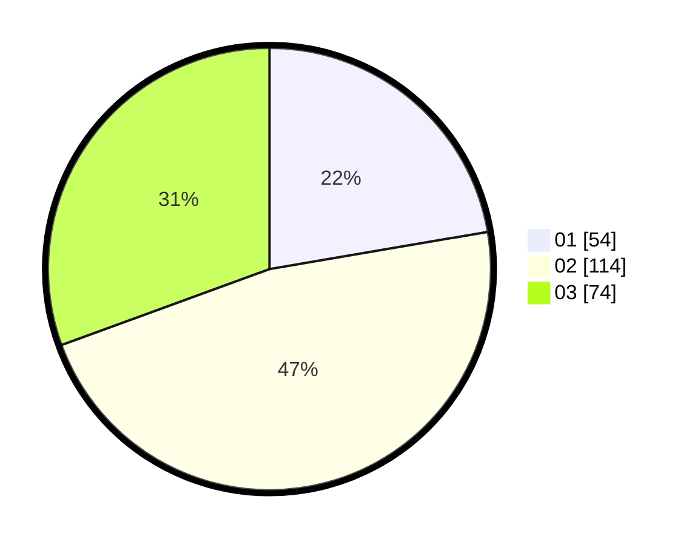

# Hasil

Hasil perolehan suara paslon dapat dilihat pada file paslon-01.txt, paslon-02.txt, dan paslon-03.txt.

Jika tidak ada, artinya data tersebut belum ada pada SIREKAP.

## Perolehan Suara

 * Paslon 01: **54**.
 * Paslon 02: **114**.
 * Paslon 03: **74**.

## Foto C Plano

https://sirekap-obj-formc.kpu.go.id/df1d/pemilu/ppwp/31/75/07/10/01/3175071001177-20240214-221522--a2b5b47f-e531-4d68-83f8-93c1151b1d2b.jpg

https://sirekap-obj-formc.kpu.go.id/df1d/pemilu/ppwp/31/75/07/10/01/3175071001177-20240214-221636--a732c613-de29-4ae2-9b62-44626b8caff4.jpg

https://sirekap-obj-formc.kpu.go.id/df1d/pemilu/ppwp/31/75/07/10/01/3175071001177-20240214-221736--06ac84f3-18cb-458c-884c-c7413ecb13ad.jpg

## DATA PEMILIH TETAP

Jumlah pemilih dalam DPT: **206**.
 * L: **92**.
 * P: **114**.

## DATA PENGGUNA HAK PILIH

Jumlah pengguna hak pilih dalam DPT: **275**.
 * L: **128**.
 * P: **147**.

Jumlah pengguna hak pilih dalam DPTb: **1**.
 * L: **1**.
 * P: **0**.

Jumlah pengguna hak pilih dalam DPK: **0**.
 * L: **0**.
 * P: **0**.

Jumlah pengguna hak pilih: **276**.
 * L: **129**.
 * P: **147**.

## JUMLAH SUARA SAH DAN TIDAK SAH

JUMLAH SELURUH SUARA SAH: **202**.

JUMLAH SUARA TIDAK SAH: **4**.

JUMLAH SELURUH SUARA SAH DAN SUARA TIDAK SAH: **206**.
