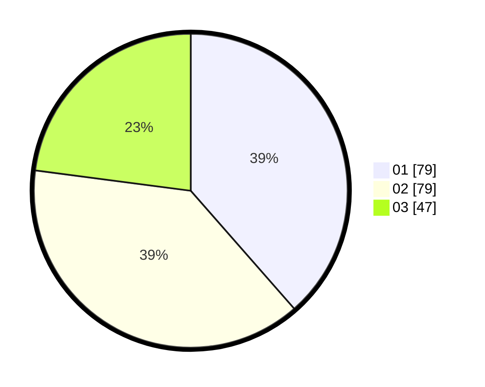

# Hasil

Hasil perolehan suara paslon dapat dilihat pada file paslon-01.txt, paslon-02.txt, dan paslon-03.txt.

Jika tidak ada, artinya data tersebut belum ada pada SIREKAP.

## Perolehan Suara

 * Paslon 01: **79**.
 * Paslon 02: **79**.
 * Paslon 03: **47**.

## Foto C Plano

https://sirekap-obj-formc.kpu.go.id/d6a3/pemilu/ppwp/31/75/07/10/01/3175071001178-20240214-155726--0305a737-1f11-4d4e-ab31-f5b19088ecdd.jpg

https://sirekap-obj-formc.kpu.go.id/d6a3/pemilu/ppwp/31/75/07/10/01/3175071001178-20240214-155623--01e92c4a-bb13-476c-bab8-6438c4c90754.jpg

https://sirekap-obj-formc.kpu.go.id/d6a3/pemilu/ppwp/31/75/07/10/01/3175071001178-20240214-155809--c7eb7c5b-344b-4e47-a919-6a1d1254b4ce.jpg

## DATA PEMILIH TETAP

Jumlah pemilih dalam DPT: **266**.
 * L: **137**.
 * P: **129**.

## DATA PENGGUNA HAK PILIH

Jumlah pengguna hak pilih dalam DPT: **206**.
 * L: **100**.
 * P: **106**.

Jumlah pengguna hak pilih dalam DPTb: **0**.
 * L: **0**.
 * P: **0**.

Jumlah pengguna hak pilih dalam DPK: **2**.
 * L: **1**.
 * P: **1**.

Jumlah pengguna hak pilih: **208**.
 * L: **101**.
 * P: **107**.

## JUMLAH SUARA SAH DAN TIDAK SAH

JUMLAH SELURUH SUARA SAH: **205**.

JUMLAH SUARA TIDAK SAH: **3**.

JUMLAH SELURUH SUARA SAH DAN SUARA TIDAK SAH: **208**.
