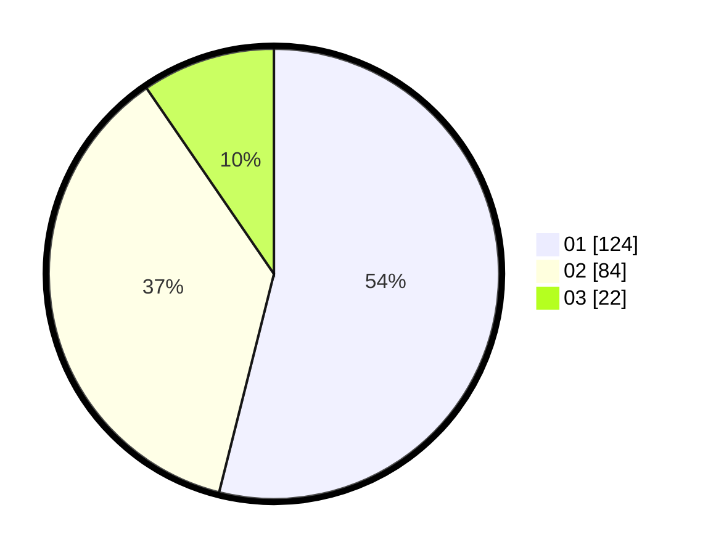

# Hasil

Hasil perolehan suara paslon dapat dilihat pada file paslon-01.txt, paslon-02.txt, dan paslon-03.txt.

Jika tidak ada, artinya data tersebut belum ada pada SIREKAP.

## Perolehan Suara

 * Paslon 01: **124**.
 * Paslon 02: **84**.
 * Paslon 03: **22**.

## Foto C Plano

https://sirekap-obj-formc.kpu.go.id/a3cb/pemilu/ppwp/31/75/07/10/01/3175071001186-20240215-010210--8701b758-8abc-4950-81b4-a6b2e7df9f5d.jpg

https://sirekap-obj-formc.kpu.go.id/a3cb/pemilu/ppwp/31/75/07/10/01/3175071001186-20240215-015425--511f6997-2436-440c-8b54-a566f125d9f5.jpg

https://sirekap-obj-formc.kpu.go.id/a3cb/pemilu/ppwp/31/75/07/10/01/3175071001186-20240214-210325--2a298ed7-38d4-441c-a8df-27d8d1fdecad.jpg
