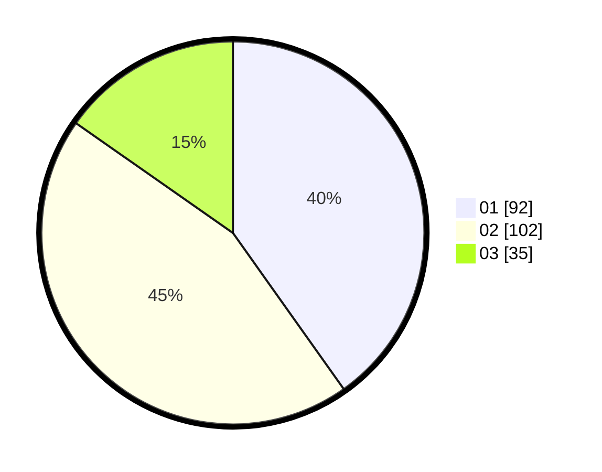

# Hasil

Hasil perolehan suara paslon dapat dilihat pada file paslon-01.txt, paslon-02.txt, dan paslon-03.txt.

Jika tidak ada, artinya data tersebut belum ada pada SIREKAP.

## Perolehan Suara

 * Paslon 01: **92**.
 * Paslon 02: **102**.
 * Paslon 03: **35**.

## Foto C Plano

https://sirekap-obj-formc.kpu.go.id/3e7a/pemilu/ppwp/31/75/07/10/01/3175071001188-20240215-224819--b2c9cc76-caff-4e5b-935e-da65c4d9f4b9.jpg

https://sirekap-obj-formc.kpu.go.id/3e7a/pemilu/ppwp/31/75/07/10/01/3175071001188-20240215-224821--aeaa6264-306d-436a-8e58-4e9135087f5f.jpg

https://sirekap-obj-formc.kpu.go.id/3e7a/pemilu/ppwp/31/75/07/10/01/3175071001188-20240214-205736--2ebbd8fc-200f-4584-8d4b-596aa5fe7773.jpg

## DATA PEMILIH TETAP

Jumlah pemilih dalam DPT: **259**.
 * L: **126**.
 * P: **133**.

## DATA PENGGUNA HAK PILIH

Jumlah pengguna hak pilih dalam DPT: **225**.
 * L: **108**.
 * P: **117**.

Jumlah pengguna hak pilih dalam DPTb: **6**.
 * L: **3**.
 * P: **3**.

Jumlah pengguna hak pilih dalam DPK: **2**.
 * L: **1**.
 * P: **1**.

Jumlah pengguna hak pilih: **233**.
 * L: **112**.
 * P: **121**.

## JUMLAH SUARA SAH DAN TIDAK SAH

JUMLAH SELURUH SUARA SAH: **229**.

JUMLAH SUARA TIDAK SAH: **4**.

JUMLAH SELURUH SUARA SAH DAN SUARA TIDAK SAH: **233**.
