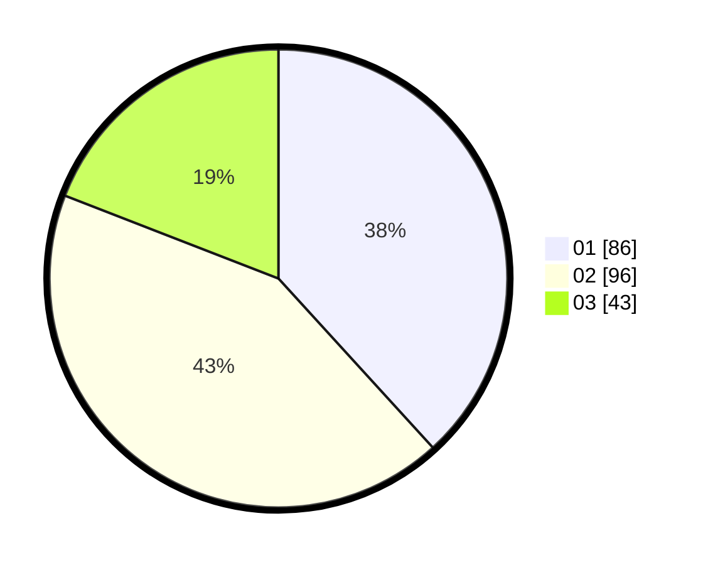

# Hasil

Hasil perolehan suara paslon dapat dilihat pada file paslon-01.txt, paslon-02.txt, dan paslon-03.txt.

Jika tidak ada, artinya data tersebut belum ada pada SIREKAP.

## Perolehan Suara

 * Paslon 01: **86**.
 * Paslon 02: **96**.
 * Paslon 03: **43**.

## Foto C Plano

https://sirekap-obj-formc.kpu.go.id/abc1/pemilu/ppwp/31/75/07/10/01/3175071001189-20240215-005343--21dae790-43bb-44b1-983f-2e34530e2791.jpg

https://sirekap-obj-formc.kpu.go.id/abc1/pemilu/ppwp/31/75/07/10/01/3175071001189-20240214-232206--2b015818-d480-44ef-ba27-13b896ba82ae.jpg

https://sirekap-obj-formc.kpu.go.id/abc1/pemilu/ppwp/31/75/07/10/01/3175071001189-20240214-232323--cb5aa094-bdb8-4c51-aa28-8550371157fd.jpg
