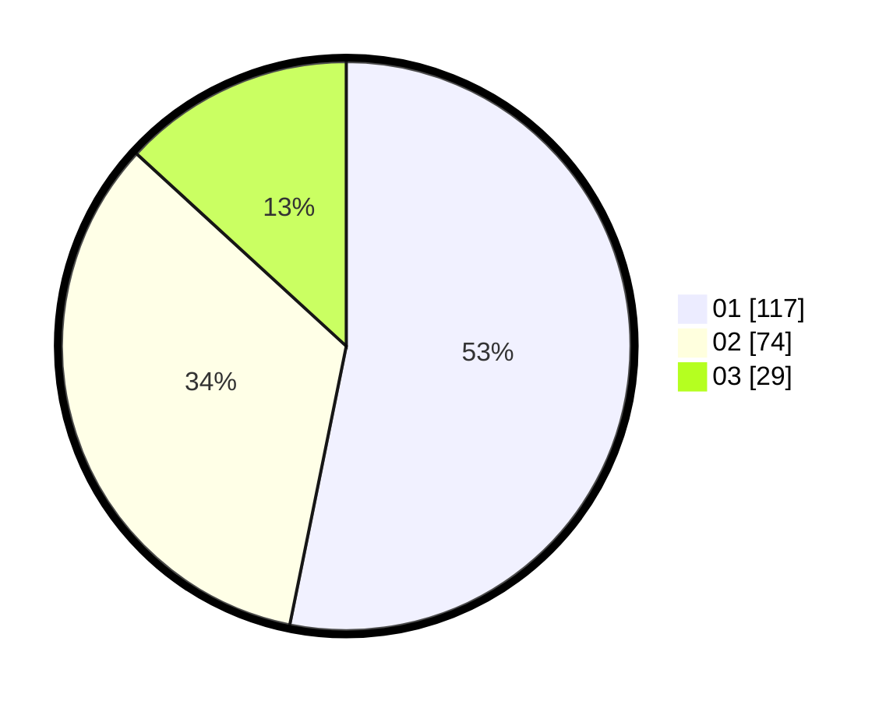

# Hasil

Hasil perolehan suara paslon dapat dilihat pada file paslon-01.txt, paslon-02.txt, dan paslon-03.txt.

Jika tidak ada, artinya data tersebut belum ada pada SIREKAP.

## Perolehan Suara

 * Paslon 01: **117**.
 * Paslon 02: **74**.
 * Paslon 03: **29**.

## Foto C Plano

https://sirekap-obj-formc.kpu.go.id/afe5/pemilu/ppwp/31/75/07/10/01/3175071001193-20240214-235255--cad1eac7-a3b9-497e-ac1a-1f172da61402.jpg

https://sirekap-obj-formc.kpu.go.id/afe5/pemilu/ppwp/31/75/07/10/01/3175071001193-20240215-211359--437a44f3-cb1a-41f4-adca-5ac77962097b.jpg

https://sirekap-obj-formc.kpu.go.id/afe5/pemilu/ppwp/31/75/07/10/01/3175071001193-20240215-000106--882707be-255e-478a-b6c1-10306b796075.jpg

## DATA PEMILIH TETAP

Jumlah pemilih dalam DPT: **267**.
 * L: **132**.
 * P: **135**.

## DATA PENGGUNA HAK PILIH

Jumlah pengguna hak pilih dalam DPT: **219**.
 * L: **104**.
 * P: **115**.

Jumlah pengguna hak pilih dalam DPTb: **9**.
 * L: **0**.
 * P: **9**.

Jumlah pengguna hak pilih dalam DPK: **0**.
 * L: **0**.
 * P: **0**.

Jumlah pengguna hak pilih: **228**.
 * L: **104**.
 * P: **124**.

## JUMLAH SUARA SAH DAN TIDAK SAH

JUMLAH SELURUH SUARA SAH: **220**.

JUMLAH SUARA TIDAK SAH: **8**.

JUMLAH SELURUH SUARA SAH DAN SUARA TIDAK SAH: **228**.
