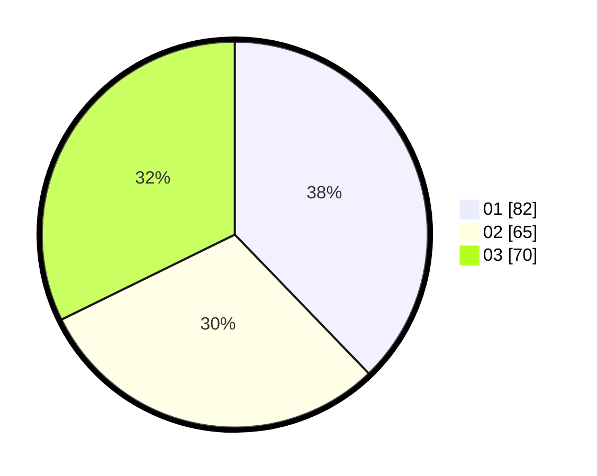

# Hasil

Hasil perolehan suara paslon dapat dilihat pada file paslon-01.txt, paslon-02.txt, dan paslon-03.txt.

Jika tidak ada, artinya data tersebut belum ada pada SIREKAP.

## Perolehan Suara

 * Paslon 01: **82**.
 * Paslon 02: **65**.
 * Paslon 03: **70**.

## Foto C Plano

https://sirekap-obj-formc.kpu.go.id/67cd/pemilu/ppwp/31/75/07/10/01/3175071001199-20240215-031906--92ffdc30-d41c-4396-bb6f-16d6320d0470.jpg

https://sirekap-obj-formc.kpu.go.id/67cd/pemilu/ppwp/31/75/07/10/01/3175071001199-20240215-032030--91206a1f-23c9-4792-9090-fa12ba06d594.jpg

https://sirekap-obj-formc.kpu.go.id/67cd/pemilu/ppwp/31/75/07/10/01/3175071001199-20240215-032107--c547e3f5-664f-4c95-85f2-adb3dfae1b8a.jpg

## DATA PEMILIH TETAP

Jumlah pemilih dalam DPT: **264**.
 * L: **123**.
 * P: **141**.

## DATA PENGGUNA HAK PILIH

Jumlah pengguna hak pilih dalam DPT: **212**.
 * L: **100**.
 * P: **112**.

Jumlah pengguna hak pilih dalam DPTb: **0**.
 * L: **0**.
 * P: **0**.

Jumlah pengguna hak pilih dalam DPK: **7**.
 * L: **1**.
 * P: **6**.

Jumlah pengguna hak pilih: **219**.
 * L: **101**.
 * P: **118**.

## JUMLAH SUARA SAH DAN TIDAK SAH

JUMLAH SELURUH SUARA SAH: **217**.

JUMLAH SUARA TIDAK SAH: **2**.

JUMLAH SELURUH SUARA SAH DAN SUARA TIDAK SAH: **219**.
