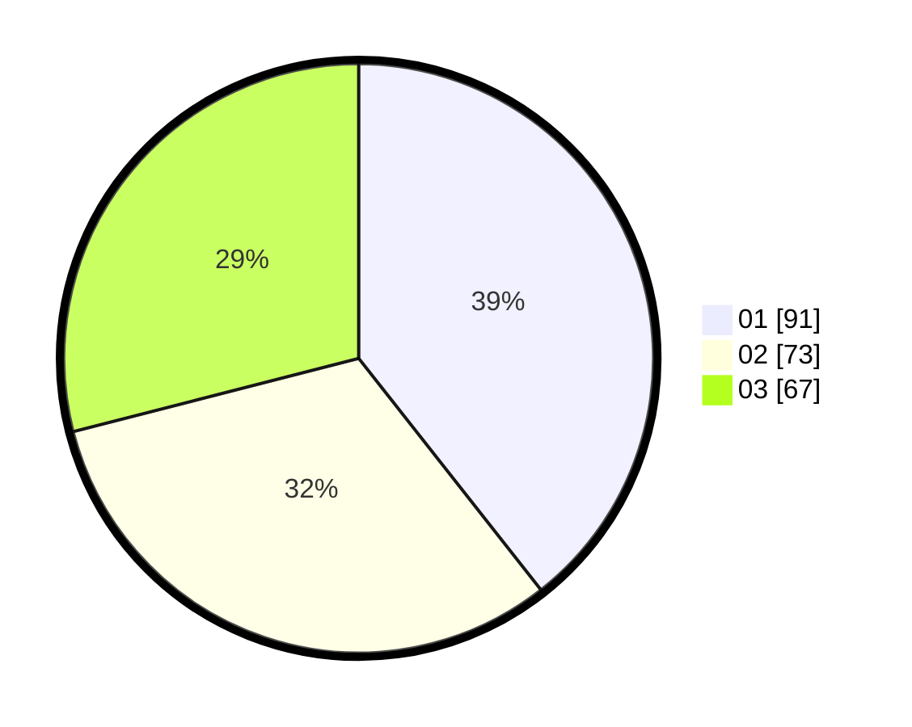

# Hasil

Hasil perolehan suara paslon dapat dilihat pada file paslon-01.txt, paslon-02.txt, dan paslon-03.txt.

Jika tidak ada, artinya data tersebut belum ada pada SIREKAP.

## Perolehan Suara

 * Paslon 01: **91**.
 * Paslon 02: **73**.
 * Paslon 03: **67**.

## Foto C Plano

https://sirekap-obj-formc.kpu.go.id/99ac/pemilu/ppwp/31/75/07/10/01/3175071001203-20240214-155707--6a97cad8-e496-4ac8-827a-5f0807ffdb35.jpg

https://sirekap-obj-formc.kpu.go.id/99ac/pemilu/ppwp/31/75/07/10/01/3175071001203-20240215-002517--68179bbe-699a-4959-8a1e-0a821a65958a.jpg

https://sirekap-obj-formc.kpu.go.id/99ac/pemilu/ppwp/31/75/07/10/01/3175071001203-20240215-002830--f4a887c1-9e2d-4cdc-bb23-c405f5305a47.jpg

## DATA PEMILIH TETAP

Jumlah pemilih dalam DPT: **237**.
 * L: **109**.
 * P: **128**.

## DATA PENGGUNA HAK PILIH

Jumlah pengguna hak pilih dalam DPT: **227**.
 * L: **103**.
 * P: **124**.

Jumlah pengguna hak pilih dalam DPTb: **2**.
 * L: **2**.
 * P: **0**.

Jumlah pengguna hak pilih dalam DPK: **8**.
 * L: **4**.
 * P: **4**.

Jumlah pengguna hak pilih: **237**.
 * L: **109**.
 * P: **128**.

## JUMLAH SUARA SAH DAN TIDAK SAH

JUMLAH SELURUH SUARA SAH: **231**.

JUMLAH SUARA TIDAK SAH: **6**.

JUMLAH SELURUH SUARA SAH DAN SUARA TIDAK SAH: **237**.
