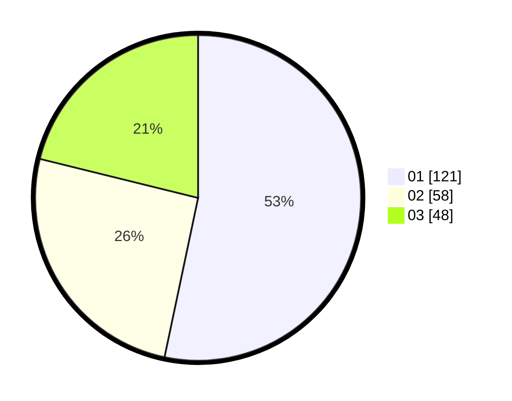

# Hasil

Hasil perolehan suara paslon dapat dilihat pada file paslon-01.txt, paslon-02.txt, dan paslon-03.txt.

Jika tidak ada, artinya data tersebut belum ada pada SIREKAP.

## Perolehan Suara

 * Paslon 01: **121**.
 * Paslon 02: **58**.
 * Paslon 03: **48**.

## Foto C Plano

https://sirekap-obj-formc.kpu.go.id/d095/pemilu/ppwp/31/75/07/10/01/3175071001206-20240214-155113--33fe96e0-0ae5-4833-86ea-9e5dec836dba.jpg

https://sirekap-obj-formc.kpu.go.id/d095/pemilu/ppwp/31/75/07/10/01/3175071001206-20240214-195219--3fb34945-afeb-46a6-8c6f-0f29b71219f8.jpg

https://sirekap-obj-formc.kpu.go.id/d095/pemilu/ppwp/31/75/07/10/01/3175071001206-20240214-160109--dfe10649-6168-4562-83f0-147887e8c3d6.jpg

## DATA PEMILIH TETAP

Jumlah pemilih dalam DPT: **274**.
 * L: **126**.
 * P: **148**.

## DATA PENGGUNA HAK PILIH

Jumlah pengguna hak pilih dalam DPT: **229**.
 * L: **101**.
 * P: **128**.

Jumlah pengguna hak pilih dalam DPTb: **5**.
 * L: **2**.
 * P: **3**.

Jumlah pengguna hak pilih dalam DPK: **0**.
 * L: **0**.
 * P: **0**.

Jumlah pengguna hak pilih: **234**.
 * L: **103**.
 * P: **131**.

## JUMLAH SUARA SAH DAN TIDAK SAH

JUMLAH SELURUH SUARA SAH: **227**.

JUMLAH SUARA TIDAK SAH: **7**.

JUMLAH SELURUH SUARA SAH DAN SUARA TIDAK SAH: **234**.
