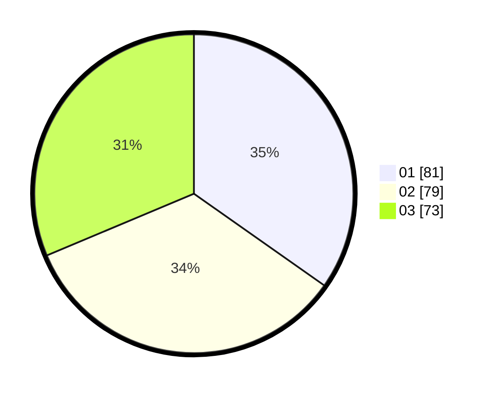

# Hasil

Hasil perolehan suara paslon dapat dilihat pada file paslon-01.txt, paslon-02.txt, dan paslon-03.txt.

Jika tidak ada, artinya data tersebut belum ada pada SIREKAP.

## Perolehan Suara

 * Paslon 01: **81**.
 * Paslon 02: **79**.
 * Paslon 03: **73**.

## Foto C Plano

https://sirekap-obj-formc.kpu.go.id/762f/pemilu/ppwp/31/75/07/10/01/3175071001207-20240215-111515--7cc8081a-7e50-4537-a6cf-0e481ac08fd4.jpg

https://sirekap-obj-formc.kpu.go.id/762f/pemilu/ppwp/31/75/07/10/01/3175071001207-20240215-111658--42935e02-f586-4005-b877-09ce1fab43da.jpg

https://sirekap-obj-formc.kpu.go.id/762f/pemilu/ppwp/31/75/07/10/01/3175071001207-20240215-111804--962e60ad-2f71-4e85-8e59-3a381988264c.jpg

## DATA PEMILIH TETAP

Jumlah pemilih dalam DPT: **265**.
 * L: **118**.
 * P: **147**.

## DATA PENGGUNA HAK PILIH

Jumlah pengguna hak pilih dalam DPT: **230**.
 * L: **106**.
 * P: **124**.

Jumlah pengguna hak pilih dalam DPTb: **3**.
 * L: **1**.
 * P: **2**.

Jumlah pengguna hak pilih dalam DPK: **1**.
 * L: **0**.
 * P: **1**.

Jumlah pengguna hak pilih: **234**.
 * L: **107**.
 * P: **127**.

## JUMLAH SUARA SAH DAN TIDAK SAH

JUMLAH SELURUH SUARA SAH: **233**.

JUMLAH SUARA TIDAK SAH: **1**.

JUMLAH SELURUH SUARA SAH DAN SUARA TIDAK SAH: **234**.
