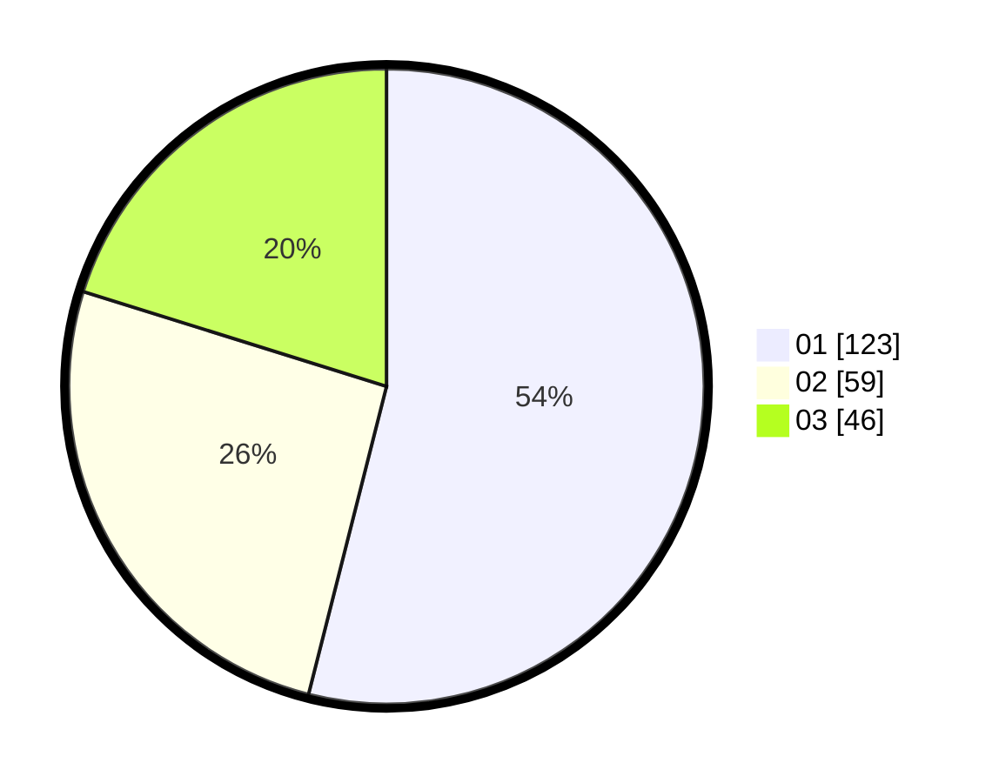

# Hasil

Hasil perolehan suara paslon dapat dilihat pada file paslon-01.txt, paslon-02.txt, dan paslon-03.txt.

Jika tidak ada, artinya data tersebut belum ada pada SIREKAP.

## Perolehan Suara

 * Paslon 01: **123**.
 * Paslon 02: **59**.
 * Paslon 03: **46**.

## Foto C Plano

https://sirekap-obj-formc.kpu.go.id/c64d/pemilu/ppwp/31/75/07/10/01/3175071001208-20240215-140153--4e68d110-12e2-4531-b92a-5578cc6f73ad.jpg

https://sirekap-obj-formc.kpu.go.id/c64d/pemilu/ppwp/31/75/07/10/01/3175071001208-20240215-140217--f6d74fba-6c72-4df8-aea9-7f47e9128a83.jpg

https://sirekap-obj-formc.kpu.go.id/c64d/pemilu/ppwp/31/75/07/10/01/3175071001208-20240215-140203--4589d3b5-8bff-4c05-a924-129739f817b6.jpg

## DATA PEMILIH TETAP

Jumlah pemilih dalam DPT: **270**.
 * L: **125**.
 * P: **145**.

## DATA PENGGUNA HAK PILIH

Jumlah pengguna hak pilih dalam DPT: **224**.
 * L: **101**.
 * P: **123**.

Jumlah pengguna hak pilih dalam DPTb: **1**.
 * L: **1**.
 * P: **0**.

Jumlah pengguna hak pilih dalam DPK: **3**.
 * L: **2**.
 * P: **1**.

Jumlah pengguna hak pilih: **228**.
 * L: **104**.
 * P: **124**.

## JUMLAH SUARA SAH DAN TIDAK SAH

JUMLAH SELURUH SUARA SAH: **228**.

JUMLAH SUARA TIDAK SAH: **0**.

JUMLAH SELURUH SUARA SAH DAN SUARA TIDAK SAH: **228**.
