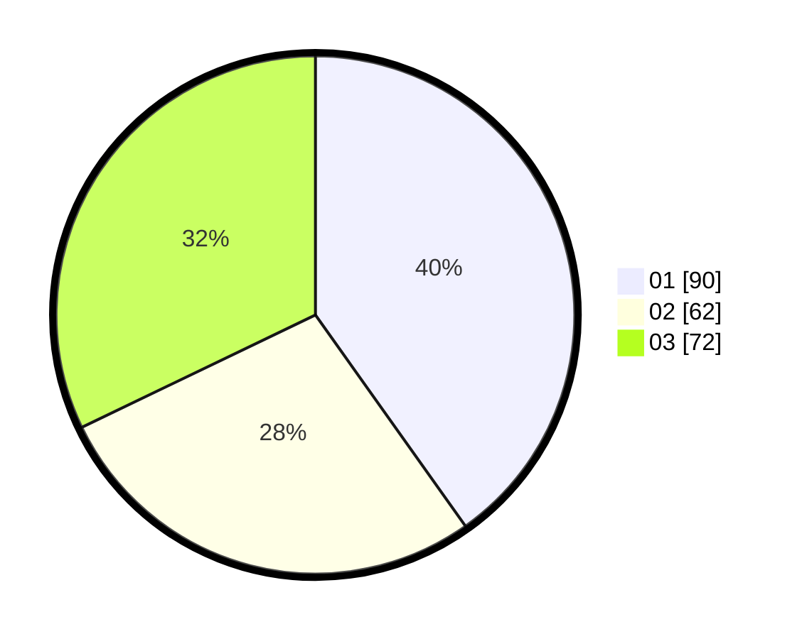

# Hasil

Hasil perolehan suara paslon dapat dilihat pada file paslon-01.txt, paslon-02.txt, dan paslon-03.txt.

Jika tidak ada, artinya data tersebut belum ada pada SIREKAP.

## Perolehan Suara

 * Paslon 01: **90**.
 * Paslon 02: **62**.
 * Paslon 03: **72**.

## Foto C Plano

https://sirekap-obj-formc.kpu.go.id/070e/pemilu/ppwp/31/75/07/10/01/3175071001209-20240214-155553--415e6f0f-8b6b-47e0-ada2-49e719d8b6a3.jpg

https://sirekap-obj-formc.kpu.go.id/070e/pemilu/ppwp/31/75/07/10/01/3175071001209-20240214-155654--071d220e-c4d2-4484-8f14-6373f29694b8.jpg

https://sirekap-obj-formc.kpu.go.id/070e/pemilu/ppwp/31/75/07/10/01/3175071001209-20240214-155741--1baf2b2f-625a-4c04-8c34-a1241916823f.jpg

## DATA PEMILIH TETAP

Jumlah pemilih dalam DPT: **270**.
 * L: **133**.
 * P: **137**.

## DATA PENGGUNA HAK PILIH

Jumlah pengguna hak pilih dalam DPT: **225**.
 * L: **107**.
 * P: **118**.

Jumlah pengguna hak pilih dalam DPTb: **6**.
 * L: **1**.
 * P: **5**.

Jumlah pengguna hak pilih dalam DPK: **1**.
 * L: **1**.
 * P: **0**.

Jumlah pengguna hak pilih: **232**.
 * L: **109**.
 * P: **123**.

## JUMLAH SUARA SAH DAN TIDAK SAH

JUMLAH SELURUH SUARA SAH: **224**.

JUMLAH SUARA TIDAK SAH: **8**.

JUMLAH SELURUH SUARA SAH DAN SUARA TIDAK SAH: **232**.
