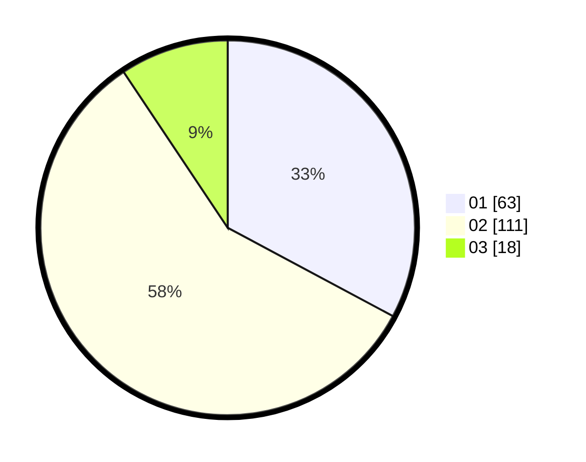

# Hasil

Hasil perolehan suara paslon dapat dilihat pada file paslon-01.txt, paslon-02.txt, dan paslon-03.txt.

Jika tidak ada, artinya data tersebut belum ada pada SIREKAP.

## Perolehan Suara

 * Paslon 01: **63**.
 * Paslon 02: **111**.
 * Paslon 03: **18**.

## Foto C Plano

https://sirekap-obj-formc.kpu.go.id/9cd5/pemilu/ppwp/31/75/07/10/02/3175071002005-20240216-135028--31943891-b421-49e8-854d-45427fefb73c.jpg

https://sirekap-obj-formc.kpu.go.id/9cd5/pemilu/ppwp/31/75/07/10/02/3175071002005-20240216-135029--4b81682e-a518-4505-b04a-35ed7ae311d1.jpg

https://sirekap-obj-formc.kpu.go.id/9cd5/pemilu/ppwp/31/75/07/10/02/3175071002005-20240216-135028--539a6f3e-0d26-4121-aede-95c31f5b72b0.jpg

## DATA PEMILIH TETAP

Jumlah pemilih dalam DPT: **262**.
 * L: **126**.
 * P: **136**.

## DATA PENGGUNA HAK PILIH

Jumlah pengguna hak pilih dalam DPT: **193**.
 * L: **93**.
 * P: **100**.

Jumlah pengguna hak pilih dalam DPTb: **3**.
 * L: **3**.
 * P: **0**.

Jumlah pengguna hak pilih dalam DPK: **0**.
 * L: **0**.
 * P: **0**.

Jumlah pengguna hak pilih: **196**.
 * L: **96**.
 * P: **100**.

## JUMLAH SUARA SAH DAN TIDAK SAH

JUMLAH SELURUH SUARA SAH: **196**.

JUMLAH SUARA TIDAK SAH: **4**.

JUMLAH SELURUH SUARA SAH DAN SUARA TIDAK SAH: **200**.
