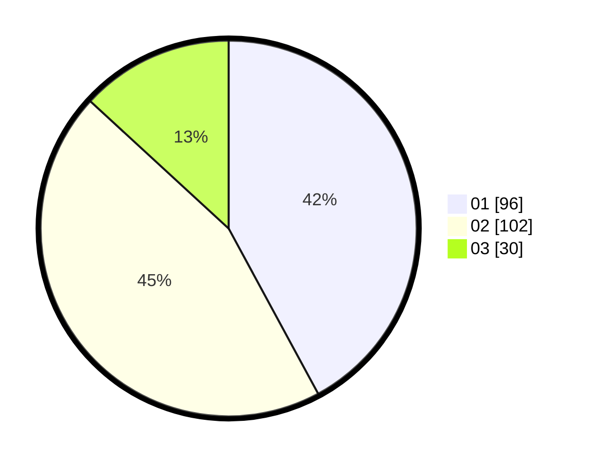

# Hasil

Hasil perolehan suara paslon dapat dilihat pada file paslon-01.txt, paslon-02.txt, dan paslon-03.txt.

Jika tidak ada, artinya data tersebut belum ada pada SIREKAP.

## Perolehan Suara

 * Paslon 01: **96**.
 * Paslon 02: **102**.
 * Paslon 03: **30**.

## Foto C Plano

https://sirekap-obj-formc.kpu.go.id/f768/pemilu/ppwp/31/75/07/10/02/3175071002006-20240214-215152--005908b9-fb87-4117-aa42-1b394605423c.jpg

https://sirekap-obj-formc.kpu.go.id/f768/pemilu/ppwp/31/75/07/10/02/3175071002006-20240214-194435--a7763135-0752-4f63-b7ed-704c15a62d73.jpg

https://sirekap-obj-formc.kpu.go.id/f768/pemilu/ppwp/31/75/07/10/02/3175071002006-20240214-194545--6eb44a43-056d-4cb5-9151-1416cb6ef841.jpg

## DATA PEMILIH TETAP

Jumlah pemilih dalam DPT: **256**.
 * L: **130**.
 * P: **126**.

## DATA PENGGUNA HAK PILIH

Jumlah pengguna hak pilih dalam DPT: **220**.
 * L: **106**.
 * P: **114**.

Jumlah pengguna hak pilih dalam DPTb: **5**.
 * L: **2**.
 * P: **3**.

Jumlah pengguna hak pilih dalam DPK: **4**.
 * L: **1**.
 * P: **3**.

Jumlah pengguna hak pilih: **229**.
 * L: **109**.
 * P: **120**.

## JUMLAH SUARA SAH DAN TIDAK SAH

JUMLAH SELURUH SUARA SAH: **228**.

JUMLAH SUARA TIDAK SAH: **1**.

JUMLAH SELURUH SUARA SAH DAN SUARA TIDAK SAH: **229**.
