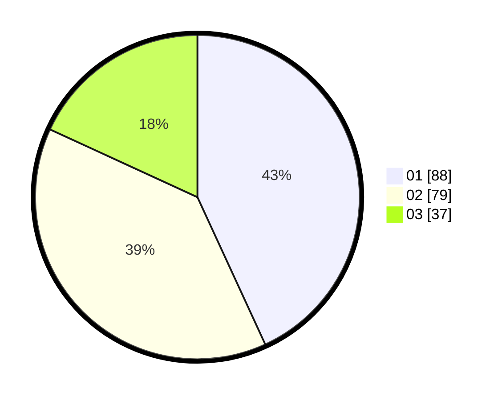

# Hasil

Hasil perolehan suara paslon dapat dilihat pada file paslon-01.txt, paslon-02.txt, dan paslon-03.txt.

Jika tidak ada, artinya data tersebut belum ada pada SIREKAP.

## Perolehan Suara

 * Paslon 01: **88**.
 * Paslon 02: **79**.
 * Paslon 03: **37**.

## Foto C Plano

https://sirekap-obj-formc.kpu.go.id/a6a6/pemilu/ppwp/31/75/07/10/02/3175071002010-20240216-002402--a8ce6be8-2196-4e91-97f6-926b7a9b8e99.jpg

https://sirekap-obj-formc.kpu.go.id/a6a6/pemilu/ppwp/31/75/07/10/02/3175071002010-20240216-002404--ff5cfcc5-7e93-48ff-b514-27ef62c3bb7c.jpg

https://sirekap-obj-formc.kpu.go.id/a6a6/pemilu/ppwp/31/75/07/10/02/3175071002010-20240216-002403--d90f5dc6-a2b5-41f9-85bc-79f215152186.jpg

## DATA PEMILIH TETAP

Jumlah pemilih dalam DPT: **260**.
 * L: **108**.
 * P: **152**.

## DATA PENGGUNA HAK PILIH

Jumlah pengguna hak pilih dalam DPT: **184**.
 * L: **74**.
 * P: **110**.

Jumlah pengguna hak pilih dalam DPTb: **19**.
 * L: **8**.
 * P: **11**.

Jumlah pengguna hak pilih dalam DPK: **4**.
 * L: **2**.
 * P: **2**.

Jumlah pengguna hak pilih: **207**.
 * L: **84**.
 * P: **123**.

## JUMLAH SUARA SAH DAN TIDAK SAH

JUMLAH SELURUH SUARA SAH: **204**.

JUMLAH SUARA TIDAK SAH: **3**.

JUMLAH SELURUH SUARA SAH DAN SUARA TIDAK SAH: **207**.
