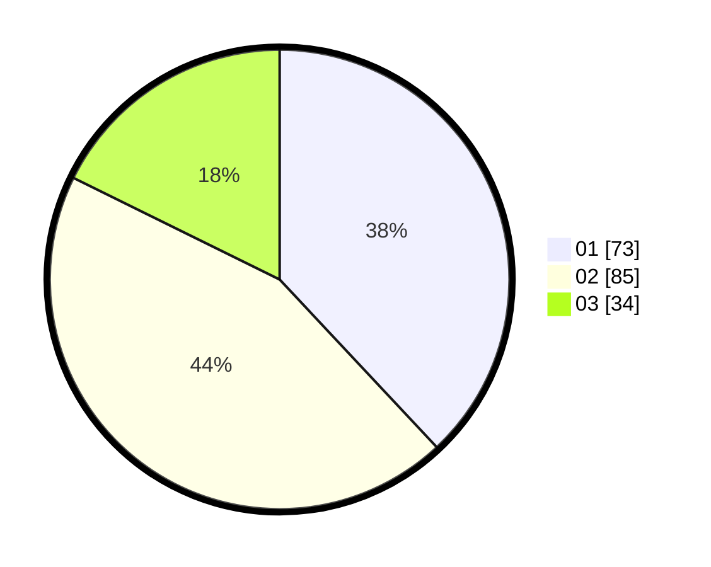

# Hasil

Hasil perolehan suara paslon dapat dilihat pada file paslon-01.txt, paslon-02.txt, dan paslon-03.txt.

Jika tidak ada, artinya data tersebut belum ada pada SIREKAP.

## Perolehan Suara

 * Paslon 01: **73**.
 * Paslon 02: **85**.
 * Paslon 03: **34**.

## Foto C Plano

https://sirekap-obj-formc.kpu.go.id/df93/pemilu/ppwp/31/75/07/10/02/3175071002015-20240216-140034--674502c3-bad3-40b5-b76a-e749a214febd.jpg

https://sirekap-obj-formc.kpu.go.id/df93/pemilu/ppwp/31/75/07/10/02/3175071002015-20240214-215411--cf63dcea-8726-4f65-9f53-df88019ecf8f.jpg

https://sirekap-obj-formc.kpu.go.id/df93/pemilu/ppwp/31/75/07/10/02/3175071002015-20240216-140034--7e5cb8a3-6602-4053-8c4a-c9fcfb24190d.jpg

## DATA PEMILIH TETAP

Jumlah pemilih dalam DPT: **266**.
 * L: **139**.
 * P: **127**.

## DATA PENGGUNA HAK PILIH

Jumlah pengguna hak pilih dalam DPT: **192**.
 * L: **92**.
 * P: **100**.

Jumlah pengguna hak pilih dalam DPTb: **0**.
 * L: **0**.
 * P: **0**.

Jumlah pengguna hak pilih dalam DPK: **1**.
 * L: **1**.
 * P: **0**.

Jumlah pengguna hak pilih: **193**.
 * L: **93**.
 * P: **100**.

## JUMLAH SUARA SAH DAN TIDAK SAH

JUMLAH SELURUH SUARA SAH: **192**.

JUMLAH SUARA TIDAK SAH: **1**.

JUMLAH SELURUH SUARA SAH DAN SUARA TIDAK SAH: **193**.
