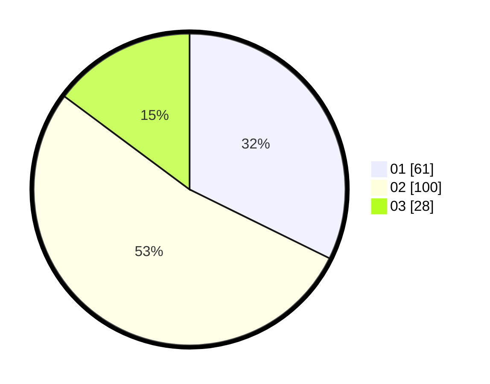

# Hasil

Hasil perolehan suara paslon dapat dilihat pada file paslon-01.txt, paslon-02.txt, dan paslon-03.txt.

Jika tidak ada, artinya data tersebut belum ada pada SIREKAP.

## Perolehan Suara

 * Paslon 01: **61**.
 * Paslon 02: **100**.
 * Paslon 03: **28**.

## Foto C Plano

https://sirekap-obj-formc.kpu.go.id/b40e/pemilu/ppwp/31/75/07/10/02/3175071002017-20240215-002619--1905c189-e939-44f8-a63f-ab324db44b8a.jpg

https://sirekap-obj-formc.kpu.go.id/b40e/pemilu/ppwp/31/75/07/10/02/3175071002017-20240215-002830--2daf31f0-3cdc-4d14-9197-acc7e145ed6c.jpg

https://sirekap-obj-formc.kpu.go.id/b40e/pemilu/ppwp/31/75/07/10/02/3175071002017-20240215-002921--47c42c12-f7f7-4f10-b467-9f3d46db24cc.jpg

## DATA PEMILIH TETAP

Jumlah pemilih dalam DPT: **262**.
 * L: **141**.
 * P: **121**.

## DATA PENGGUNA HAK PILIH

Jumlah pengguna hak pilih dalam DPT: **188**.
 * L: **96**.
 * P: **92**.

Jumlah pengguna hak pilih dalam DPTb: **0**.
 * L: **0**.
 * P: **0**.

Jumlah pengguna hak pilih dalam DPK: **4**.
 * L: **2**.
 * P: **2**.

Jumlah pengguna hak pilih: **192**.
 * L: **98**.
 * P: **94**.

## JUMLAH SUARA SAH DAN TIDAK SAH

JUMLAH SELURUH SUARA SAH: **189**.

JUMLAH SUARA TIDAK SAH: **3**.

JUMLAH SELURUH SUARA SAH DAN SUARA TIDAK SAH: **192**.
