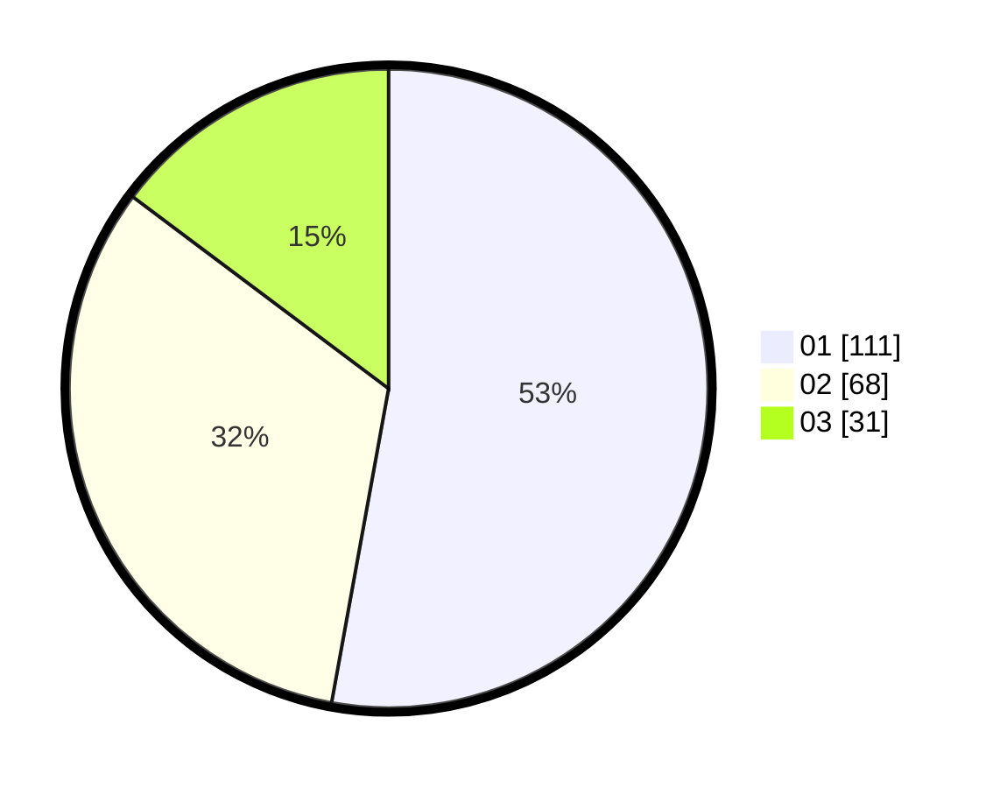

# Hasil

Hasil perolehan suara paslon dapat dilihat pada file paslon-01.txt, paslon-02.txt, dan paslon-03.txt.

Jika tidak ada, artinya data tersebut belum ada pada SIREKAP.

## Perolehan Suara

 * Paslon 01: **111**.
 * Paslon 02: **68**.
 * Paslon 03: **31**.

## Foto C Plano

https://sirekap-obj-formc.kpu.go.id/1ad9/pemilu/ppwp/31/75/07/10/02/3175071002019-20240214-220531--e4c5710c-787c-4fe5-80bd-2486cf2ae990.jpg

https://sirekap-obj-formc.kpu.go.id/1ad9/pemilu/ppwp/31/75/07/10/02/3175071002019-20240214-220730--e8dd6663-5f0b-45dd-9c5d-ef3605508cf3.jpg

https://sirekap-obj-formc.kpu.go.id/1ad9/pemilu/ppwp/31/75/07/10/02/3175071002019-20240214-221116--b05863d2-9594-47fb-81b6-92850c0213f1.jpg

## DATA PEMILIH TETAP

Jumlah pemilih dalam DPT: **256**.
 * L: **135**.
 * P: **121**.

## DATA PENGGUNA HAK PILIH

Jumlah pengguna hak pilih dalam DPT: **206**.
 * L: **103**.
 * P: **103**.

Jumlah pengguna hak pilih dalam DPTb: **0**.
 * L: **0**.
 * P: **0**.

Jumlah pengguna hak pilih dalam DPK: **5**.
 * L: **2**.
 * P: **3**.

Jumlah pengguna hak pilih: **211**.
 * L: **105**.
 * P: **106**.

## JUMLAH SUARA SAH DAN TIDAK SAH

JUMLAH SELURUH SUARA SAH: **210**.

JUMLAH SUARA TIDAK SAH: **1**.

JUMLAH SELURUH SUARA SAH DAN SUARA TIDAK SAH: **211**.
