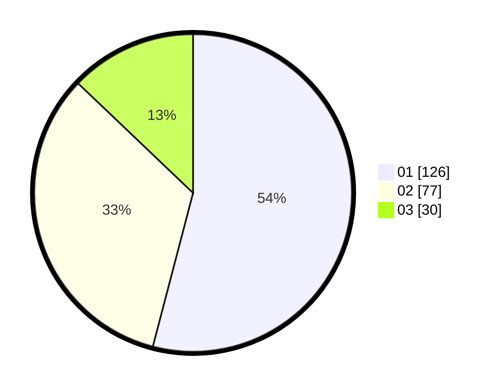

# Hasil

Hasil perolehan suara paslon dapat dilihat pada file paslon-01.txt, paslon-02.txt, dan paslon-03.txt.

Jika tidak ada, artinya data tersebut belum ada pada SIREKAP.

## Perolehan Suara

 * Paslon 01: **126**.
 * Paslon 02: **77**.
 * Paslon 03: **30**.

## Foto C Plano

https://sirekap-obj-formc.kpu.go.id/4961/pemilu/ppwp/31/75/07/10/02/3175071002025-20240214-160058--94afb98e-d339-4aa1-8d6a-dd8c9ddb1715.jpg

https://sirekap-obj-formc.kpu.go.id/4961/pemilu/ppwp/31/75/07/10/02/3175071002025-20240214-155637--fcdd2b46-807d-481c-833c-d47ad53a198b.jpg

https://sirekap-obj-formc.kpu.go.id/4961/pemilu/ppwp/31/75/07/10/02/3175071002025-20240214-155155--6d69a71a-92cc-489a-93ab-5949978a42ae.jpg

## DATA PEMILIH TETAP

Jumlah pemilih dalam DPT: **293**.
 * L: **148**.
 * P: **145**.

## DATA PENGGUNA HAK PILIH

Jumlah pengguna hak pilih dalam DPT: **231**.
 * L: **115**.
 * P: **116**.

Jumlah pengguna hak pilih dalam DPTb: **4**.
 * L: **2**.
 * P: **2**.

Jumlah pengguna hak pilih dalam DPK: **2**.
 * L: **0**.
 * P: **2**.

Jumlah pengguna hak pilih: **237**.
 * L: **117**.
 * P: **120**.

## JUMLAH SUARA SAH DAN TIDAK SAH

JUMLAH SELURUH SUARA SAH: **233**.

JUMLAH SUARA TIDAK SAH: **4**.

JUMLAH SELURUH SUARA SAH DAN SUARA TIDAK SAH: **237**.
