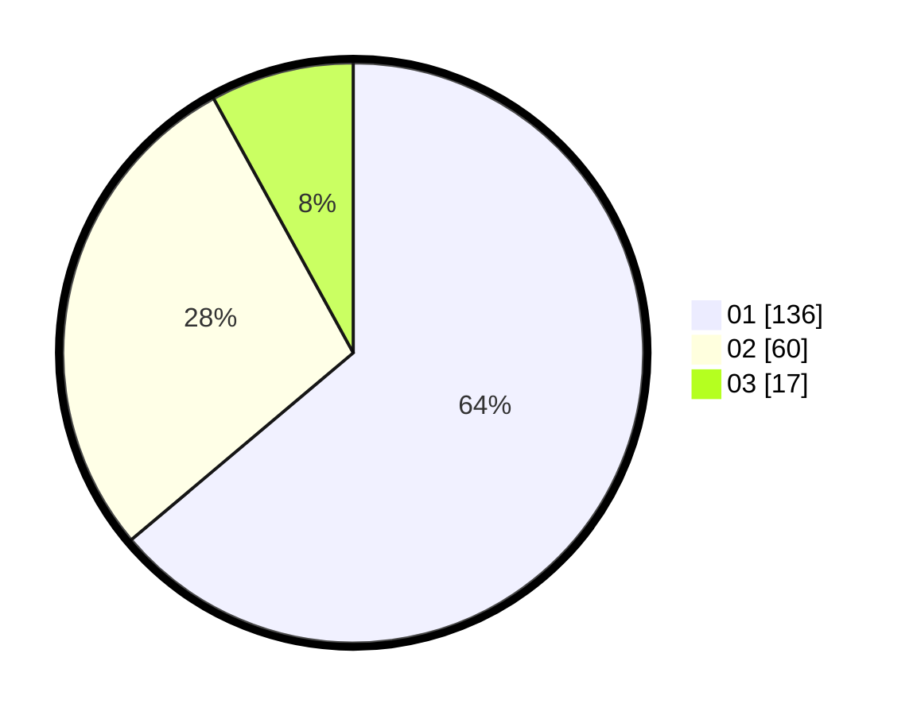

# Hasil

Hasil perolehan suara paslon dapat dilihat pada file paslon-01.txt, paslon-02.txt, dan paslon-03.txt.

Jika tidak ada, artinya data tersebut belum ada pada SIREKAP.

## Perolehan Suara

 * Paslon 01: **136**.
 * Paslon 02: **60**.
 * Paslon 03: **17**.

## Foto C Plano

https://sirekap-obj-formc.kpu.go.id/9f2a/pemilu/ppwp/31/75/07/10/02/3175071002026-20240215-014636--56b47571-b389-4bc1-a3e5-e41ba4a934f0.jpg

https://sirekap-obj-formc.kpu.go.id/9f2a/pemilu/ppwp/31/75/07/10/02/3175071002026-20240215-014727--8253dbb0-f0de-413e-a9fd-bd440ebdd258.jpg
