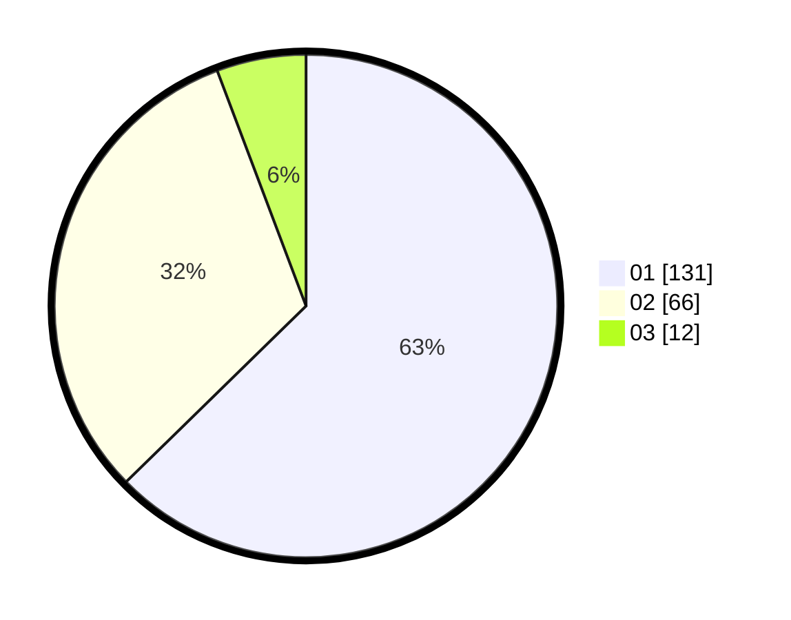

# Hasil

Hasil perolehan suara paslon dapat dilihat pada file paslon-01.txt, paslon-02.txt, dan paslon-03.txt.

Jika tidak ada, artinya data tersebut belum ada pada SIREKAP.

## Perolehan Suara

 * Paslon 01: **131**.
 * Paslon 02: **66**.
 * Paslon 03: **12**.

## Foto C Plano

https://sirekap-obj-formc.kpu.go.id/527f/pemilu/ppwp/31/75/07/10/02/3175071002027-20240215-013725--8854423e-60d5-43fd-a232-4996e45412e1.jpg

https://sirekap-obj-formc.kpu.go.id/527f/pemilu/ppwp/31/75/07/10/02/3175071002027-20240215-013914--79829435-6e0d-4cd9-b356-97a9824f5e71.jpg
