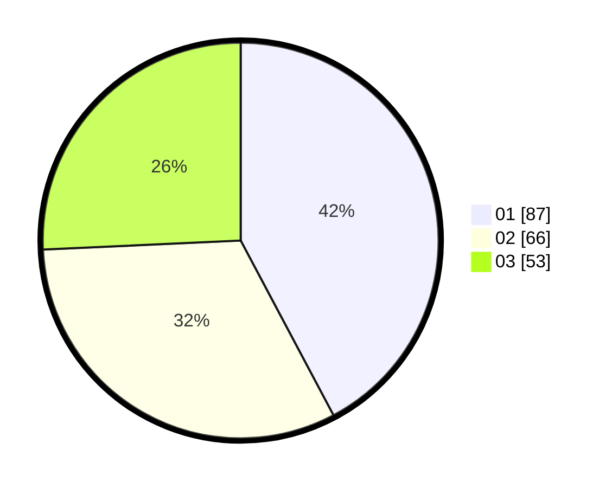

# Hasil

Hasil perolehan suara paslon dapat dilihat pada file paslon-01.txt, paslon-02.txt, dan paslon-03.txt.

Jika tidak ada, artinya data tersebut belum ada pada SIREKAP.

## Perolehan Suara

 * Paslon 01: **87**.
 * Paslon 02: **66**.
 * Paslon 03: **53**.

## Foto C Plano

https://sirekap-obj-formc.kpu.go.id/28f1/pemilu/ppwp/31/75/07/10/02/3175071002038-20240215-203530--c5c3ddaf-c697-4cd9-ab7d-e7854d3501cf.jpg

https://sirekap-obj-formc.kpu.go.id/28f1/pemilu/ppwp/31/75/07/10/02/3175071002038-20240215-203541--9252d917-1d8a-4cd5-aee1-479ba18e043e.jpg

https://sirekap-obj-formc.kpu.go.id/28f1/pemilu/ppwp/31/75/07/10/02/3175071002038-20240215-203537--9a8e3dc6-695c-4c40-bef4-d21790fc9be4.jpg

## DATA PEMILIH TETAP

Jumlah pemilih dalam DPT: **0**.
 * L: **0**.
 * P: **0**.

## DATA PENGGUNA HAK PILIH

Jumlah pengguna hak pilih dalam DPT: **0**.
 * L: **0**.
 * P: **0**.

Jumlah pengguna hak pilih dalam DPTb: **0**.
 * L: **0**.
 * P: **0**.

Jumlah pengguna hak pilih dalam DPK: **0**.
 * L: **0**.
 * P: **0**.

Jumlah pengguna hak pilih: **0**.
 * L: **0**.
 * P: **0**.

## JUMLAH SUARA SAH DAN TIDAK SAH

JUMLAH SELURUH SUARA SAH: **206**.

JUMLAH SUARA TIDAK SAH: **2**.

JUMLAH SELURUH SUARA SAH DAN SUARA TIDAK SAH: **208**.
