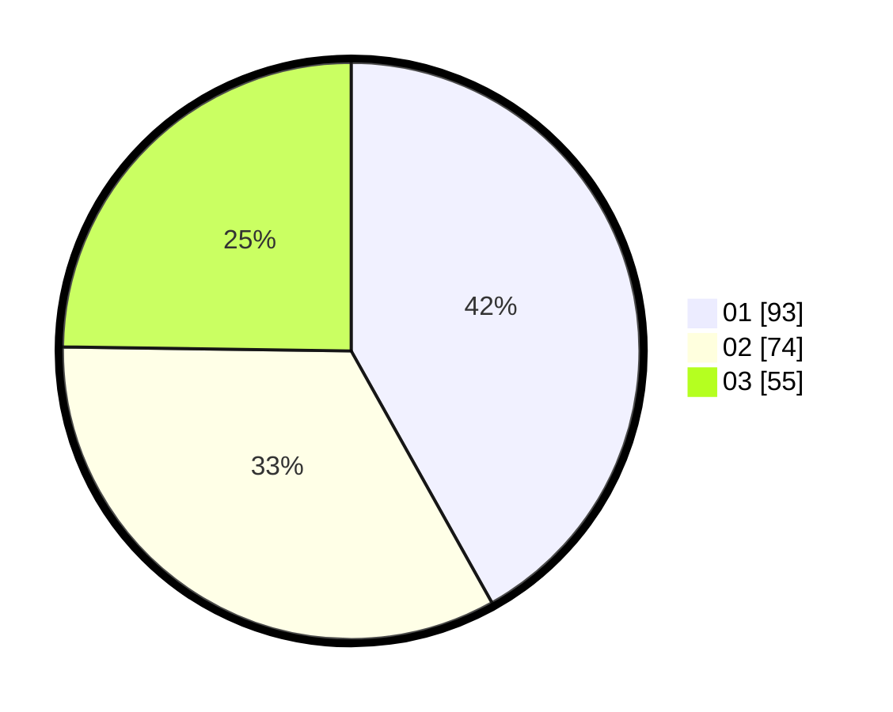

# Hasil

Hasil perolehan suara paslon dapat dilihat pada file paslon-01.txt, paslon-02.txt, dan paslon-03.txt.

Jika tidak ada, artinya data tersebut belum ada pada SIREKAP.

## Perolehan Suara

 * Paslon 01: **93**.
 * Paslon 02: **74**.
 * Paslon 03: **55**.

## Foto C Plano

https://sirekap-obj-formc.kpu.go.id/413c/pemilu/ppwp/31/75/07/10/02/3175071002040-20240214-233204--d0e28dbf-7c35-4de0-aa3a-0f7dc81703e8.jpg

https://sirekap-obj-formc.kpu.go.id/413c/pemilu/ppwp/31/75/07/10/02/3175071002040-20240214-233208--a1f57cb5-c07d-493a-9cc6-23c2a8dd8a5e.jpg

https://sirekap-obj-formc.kpu.go.id/413c/pemilu/ppwp/31/75/07/10/02/3175071002040-20240214-233217--f1eb5e1d-2e28-4984-afcc-9f52e9610c34.jpg
