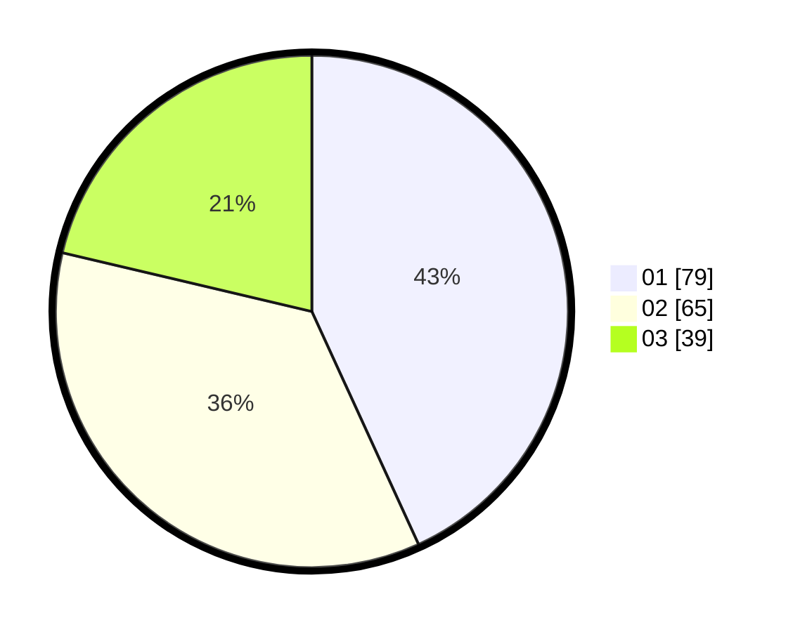

# Hasil

Hasil perolehan suara paslon dapat dilihat pada file paslon-01.txt, paslon-02.txt, dan paslon-03.txt.

Jika tidak ada, artinya data tersebut belum ada pada SIREKAP.

## Perolehan Suara

 * Paslon 01: **79**.
 * Paslon 02: **65**.
 * Paslon 03: **39**.

## Foto C Plano

https://sirekap-obj-formc.kpu.go.id/87a4/pemilu/ppwp/31/75/07/10/02/3175071002042-20240214-184941--e4510959-3d90-46bf-87e6-656d49457e4d.jpg

https://sirekap-obj-formc.kpu.go.id/87a4/pemilu/ppwp/31/75/07/10/02/3175071002042-20240214-184828--1c44c1aa-ee2b-4c35-9db4-e6b3ce887422.jpg

https://sirekap-obj-formc.kpu.go.id/87a4/pemilu/ppwp/31/75/07/10/02/3175071002042-20240214-185144--8abc65f5-f8f8-4d9f-a89e-f3e6d94643b7.jpg

## DATA PEMILIH TETAP

Jumlah pemilih dalam DPT: **261**.
 * L: **135**.
 * P: **126**.

## DATA PENGGUNA HAK PILIH

Jumlah pengguna hak pilih dalam DPT: **190**.
 * L: **96**.
 * P: **94**.

Jumlah pengguna hak pilih dalam DPTb: **0**.
 * L: **0**.
 * P: **0**.

Jumlah pengguna hak pilih dalam DPK: **0**.
 * L: **0**.
 * P: **0**.

Jumlah pengguna hak pilih: **190**.
 * L: **96**.
 * P: **94**.

## JUMLAH SUARA SAH DAN TIDAK SAH

JUMLAH SELURUH SUARA SAH: **183**.

JUMLAH SUARA TIDAK SAH: **7**.

JUMLAH SELURUH SUARA SAH DAN SUARA TIDAK SAH: **190**.
