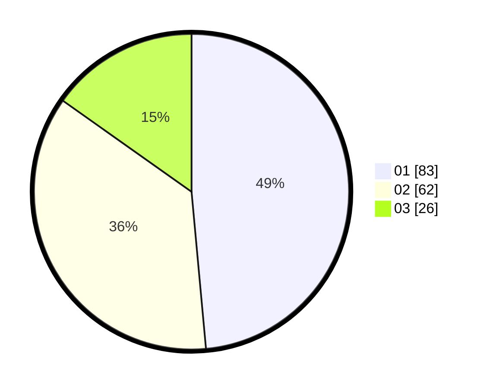

# Hasil

Hasil perolehan suara paslon dapat dilihat pada file paslon-01.txt, paslon-02.txt, dan paslon-03.txt.

Jika tidak ada, artinya data tersebut belum ada pada SIREKAP.

## Perolehan Suara

 * Paslon 01: **83**.
 * Paslon 02: **62**.
 * Paslon 03: **26**.

## Foto C Plano

https://sirekap-obj-formc.kpu.go.id/24bd/pemilu/ppwp/31/75/07/10/02/3175071002051-20240214-195833--fc1cb2fc-20e3-437b-b5ef-6d10c18a5921.jpg

https://sirekap-obj-formc.kpu.go.id/24bd/pemilu/ppwp/31/75/07/10/02/3175071002051-20240214-195921--7e71a15d-1b54-41f9-9459-6dbdd19f114e.jpg

https://sirekap-obj-formc.kpu.go.id/24bd/pemilu/ppwp/31/75/07/10/02/3175071002051-20240214-200001--ee2e5d06-5ed5-4ab3-9dbe-a77d5530c108.jpg

## DATA PEMILIH TETAP

Jumlah pemilih dalam DPT: **172**.
 * L: **84**.
 * P: **88**.

## DATA PENGGUNA HAK PILIH

Jumlah pengguna hak pilih dalam DPT: **171**.
 * L: **83**.
 * P: **88**.

Jumlah pengguna hak pilih dalam DPTb: **1**.
 * L: **1**.
 * P: **0**.

Jumlah pengguna hak pilih dalam DPK: **0**.
 * L: **0**.
 * P: **0**.

Jumlah pengguna hak pilih: **172**.
 * L: **84**.
 * P: **88**.

## JUMLAH SUARA SAH DAN TIDAK SAH

JUMLAH SELURUH SUARA SAH: **171**.

JUMLAH SUARA TIDAK SAH: **1**.

JUMLAH SELURUH SUARA SAH DAN SUARA TIDAK SAH: **172**.
