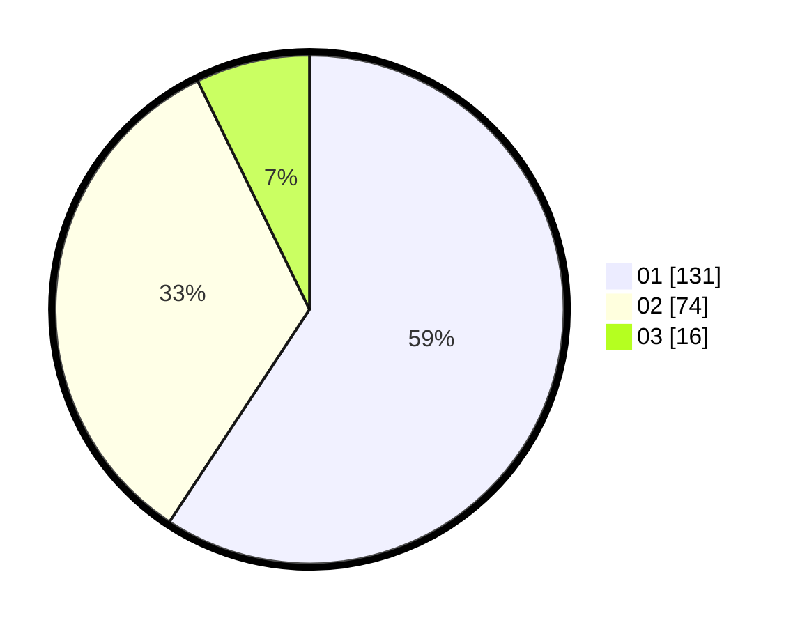

# Hasil

Hasil perolehan suara paslon dapat dilihat pada file paslon-01.txt, paslon-02.txt, dan paslon-03.txt.

Jika tidak ada, artinya data tersebut belum ada pada SIREKAP.

## Perolehan Suara

 * Paslon 01: **131**.
 * Paslon 02: **74**.
 * Paslon 03: **16**.

## Foto C Plano

https://sirekap-obj-formc.kpu.go.id/ce18/pemilu/ppwp/31/75/07/10/02/3175071002052-20240216-211259--920ebca2-1bf3-4d39-9eea-0776c77e3ca6.jpg

https://sirekap-obj-formc.kpu.go.id/ce18/pemilu/ppwp/31/75/07/10/02/3175071002052-20240216-211300--daa26e08-c9dd-4cd0-8579-6b1f2ddfb583.jpg

https://sirekap-obj-formc.kpu.go.id/ce18/pemilu/ppwp/31/75/07/10/02/3175071002052-20240216-211259--4a4e206c-5d67-45c6-bf78-411157f1fa5d.jpg

## DATA PEMILIH TETAP

Jumlah pemilih dalam DPT: **260**.
 * L: **132**.
 * P: **128**.

## DATA PENGGUNA HAK PILIH

Jumlah pengguna hak pilih dalam DPT: **215**.
 * L: **103**.
 * P: **112**.

Jumlah pengguna hak pilih dalam DPTb: **3**.
 * L: **1**.
 * P: **2**.

Jumlah pengguna hak pilih dalam DPK: **4**.
 * L: **2**.
 * P: **2**.

Jumlah pengguna hak pilih: **222**.
 * L: **106**.
 * P: **116**.

## JUMLAH SUARA SAH DAN TIDAK SAH

JUMLAH SELURUH SUARA SAH: **221**.

JUMLAH SUARA TIDAK SAH: **1**.

JUMLAH SELURUH SUARA SAH DAN SUARA TIDAK SAH: **222**.
