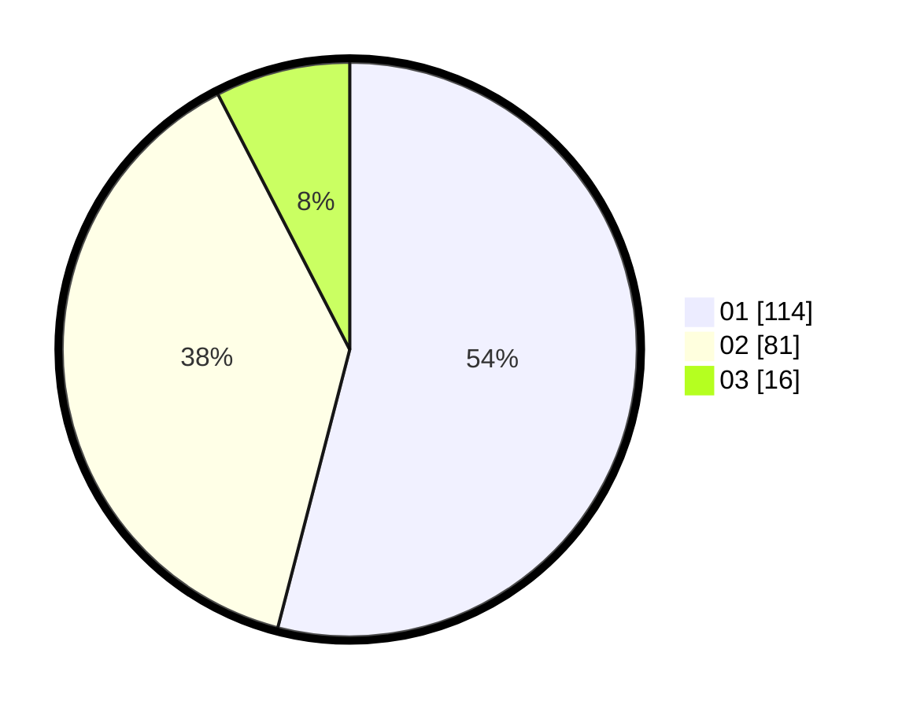

# Hasil

Hasil perolehan suara paslon dapat dilihat pada file paslon-01.txt, paslon-02.txt, dan paslon-03.txt.

Jika tidak ada, artinya data tersebut belum ada pada SIREKAP.

## Perolehan Suara

 * Paslon 01: **114**.
 * Paslon 02: **81**.
 * Paslon 03: **16**.

## Foto C Plano

https://sirekap-obj-formc.kpu.go.id/5dd6/pemilu/ppwp/31/75/07/10/02/3175071002055-20240214-211218--cc1f2ab4-9439-4ed3-9122-280b8c3ffddc.jpg

https://sirekap-obj-formc.kpu.go.id/5dd6/pemilu/ppwp/31/75/07/10/02/3175071002055-20240214-225544--2d2d77c4-0f94-4b69-9a9b-304712bfabc2.jpg

https://sirekap-obj-formc.kpu.go.id/5dd6/pemilu/ppwp/31/75/07/10/02/3175071002055-20240214-211446--42535038-473f-4f1c-be32-ec900a046640.jpg
