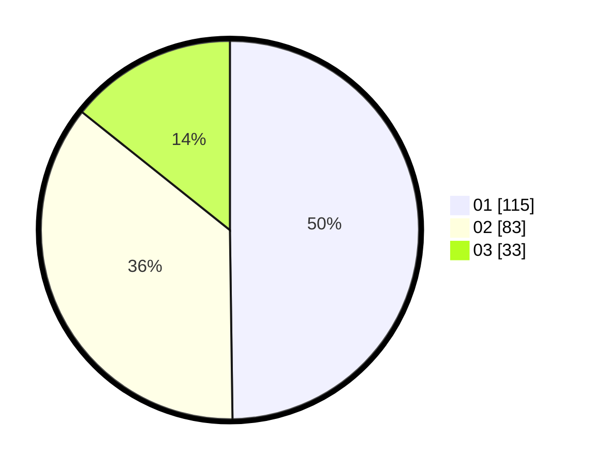

# Hasil

Hasil perolehan suara paslon dapat dilihat pada file paslon-01.txt, paslon-02.txt, dan paslon-03.txt.

Jika tidak ada, artinya data tersebut belum ada pada SIREKAP.

## Perolehan Suara

 * Paslon 01: **115**.
 * Paslon 02: **83**.
 * Paslon 03: **33**.

## Foto C Plano

https://sirekap-obj-formc.kpu.go.id/e66f/pemilu/ppwp/31/75/07/10/02/3175071002061-20240214-155539--39bd57a4-ace6-4dd6-825b-f153b0dfe772.jpg

https://sirekap-obj-formc.kpu.go.id/e66f/pemilu/ppwp/31/75/07/10/02/3175071002061-20240214-155549--31c755a4-37c2-478f-96a1-4012271dfafd.jpg

https://sirekap-obj-formc.kpu.go.id/e66f/pemilu/ppwp/31/75/07/10/02/3175071002061-20240214-155558--7aa1d9ed-964b-472b-932e-e597742aa391.jpg

## DATA PEMILIH TETAP

Jumlah pemilih dalam DPT: **290**.
 * L: **147**.
 * P: **143**.

## DATA PENGGUNA HAK PILIH

Jumlah pengguna hak pilih dalam DPT: **228**.
 * L: **113**.
 * P: **115**.

Jumlah pengguna hak pilih dalam DPTb: **0**.
 * L: **0**.
 * P: **0**.

Jumlah pengguna hak pilih dalam DPK: **2**.
 * L: **1**.
 * P: **1**.

Jumlah pengguna hak pilih: **230**.
 * L: **114**.
 * P: **116**.

## JUMLAH SUARA SAH DAN TIDAK SAH

JUMLAH SELURUH SUARA SAH: **231**.

JUMLAH SUARA TIDAK SAH: **1**.

JUMLAH SELURUH SUARA SAH DAN SUARA TIDAK SAH: **232**.
