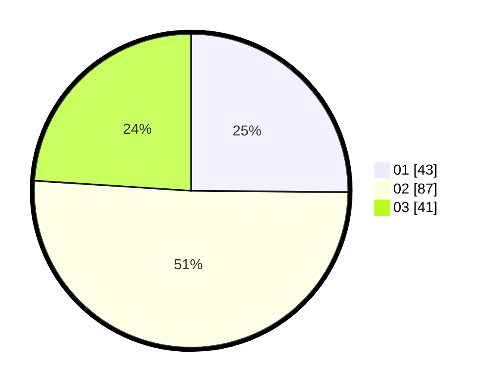

# Hasil

Hasil perolehan suara paslon dapat dilihat pada file paslon-01.txt, paslon-02.txt, dan paslon-03.txt.

Jika tidak ada, artinya data tersebut belum ada pada SIREKAP.

## Perolehan Suara

 * Paslon 01: **43**.
 * Paslon 02: **87**.
 * Paslon 03: **41**.

## Foto C Plano

https://sirekap-obj-formc.kpu.go.id/2aa1/pemilu/ppwp/31/75/07/10/02/3175071002062-20240214-201524--d58d6115-0606-46f1-b250-9e2f4efdb82d.jpg

https://sirekap-obj-formc.kpu.go.id/2aa1/pemilu/ppwp/31/75/07/10/02/3175071002062-20240214-194205--6e2b2666-4e22-4a31-8954-7248b00d3133.jpg

https://sirekap-obj-formc.kpu.go.id/2aa1/pemilu/ppwp/31/75/07/10/02/3175071002062-20240214-194219--5fee16b7-91b4-4fcd-a362-3b756a2d54f5.jpg

## DATA PEMILIH TETAP

Jumlah pemilih dalam DPT: **168**.
 * L: **89**.
 * P: **79**.

## DATA PENGGUNA HAK PILIH

Jumlah pengguna hak pilih dalam DPT: **168**.
 * L: **89**.
 * P: **79**.

Jumlah pengguna hak pilih dalam DPTb: **0**.
 * L: **0**.
 * P: **0**.

Jumlah pengguna hak pilih dalam DPK: **2**.
 * L: **2**.
 * P: **2**.

Jumlah pengguna hak pilih: **370**.
 * L: **557**.
 * P: **505**.

## JUMLAH SUARA SAH DAN TIDAK SAH

JUMLAH SELURUH SUARA SAH: **171**.

JUMLAH SUARA TIDAK SAH: **1**.

JUMLAH SELURUH SUARA SAH DAN SUARA TIDAK SAH: **172**.
