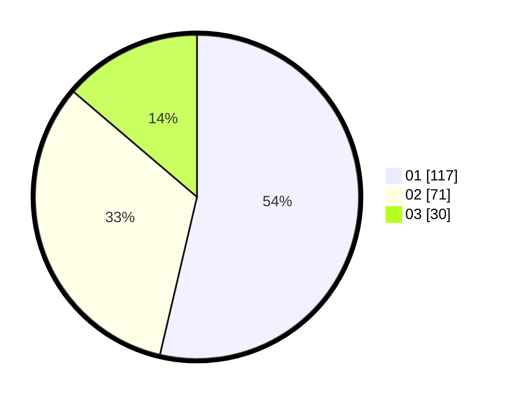

# Hasil

Hasil perolehan suara paslon dapat dilihat pada file paslon-01.txt, paslon-02.txt, dan paslon-03.txt.

Jika tidak ada, artinya data tersebut belum ada pada SIREKAP.

## Perolehan Suara

 * Paslon 01: **117**.
 * Paslon 02: **71**.
 * Paslon 03: **30**.

## Foto C Plano

https://sirekap-obj-formc.kpu.go.id/60cf/pemilu/ppwp/31/75/07/10/02/3175071002066-20240214-155302--1a9cccf3-69f2-4419-a0a4-41469e176475.jpg

https://sirekap-obj-formc.kpu.go.id/60cf/pemilu/ppwp/31/75/07/10/02/3175071002066-20240214-155306--6006b16a-2d73-4842-9d83-a5603cf73728.jpg

https://sirekap-obj-formc.kpu.go.id/60cf/pemilu/ppwp/31/75/07/10/02/3175071002066-20240214-155313--577b03de-32b7-40f8-9679-5ea409f28133.jpg

## DATA PEMILIH TETAP

Jumlah pemilih dalam DPT: **272**.
 * L: **144**.
 * P: **128**.

## DATA PENGGUNA HAK PILIH

Jumlah pengguna hak pilih dalam DPT: **213**.
 * L: **114**.
 * P: **99**.

Jumlah pengguna hak pilih dalam DPTb: **1**.
 * L: **0**.
 * P: **1**.

Jumlah pengguna hak pilih dalam DPK: **5**.
 * L: **3**.
 * P: **2**.

Jumlah pengguna hak pilih: **219**.
 * L: **117**.
 * P: **102**.

## JUMLAH SUARA SAH DAN TIDAK SAH

JUMLAH SELURUH SUARA SAH: **218**.

JUMLAH SUARA TIDAK SAH: **1**.

JUMLAH SELURUH SUARA SAH DAN SUARA TIDAK SAH: **219**.
