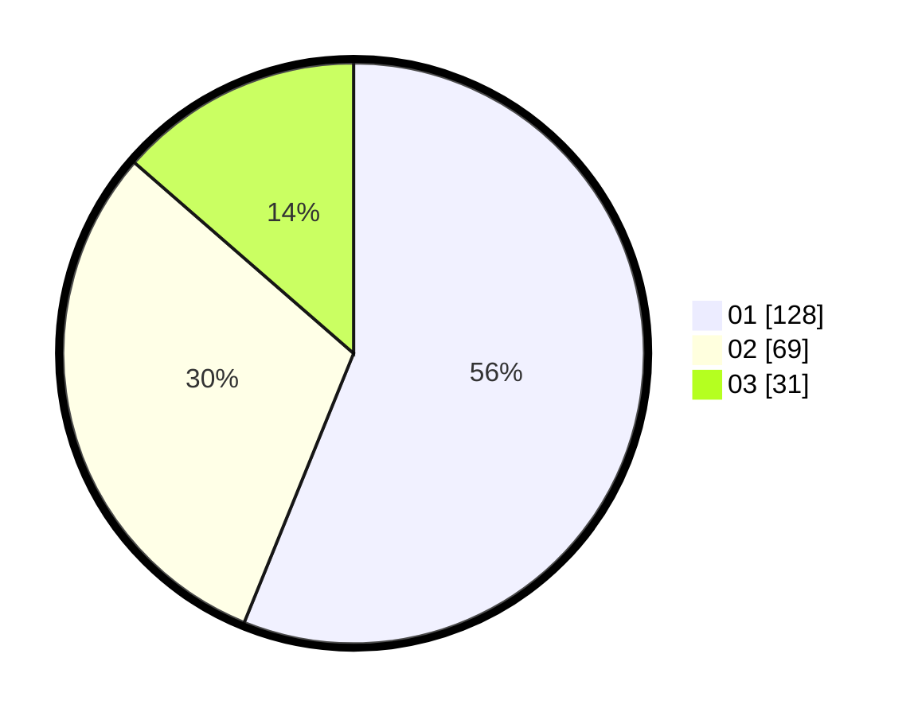

# Hasil

Hasil perolehan suara paslon dapat dilihat pada file paslon-01.txt, paslon-02.txt, dan paslon-03.txt.

Jika tidak ada, artinya data tersebut belum ada pada SIREKAP.

## Perolehan Suara

 * Paslon 01: **128**.
 * Paslon 02: **69**.
 * Paslon 03: **31**.

## Foto C Plano

https://sirekap-obj-formc.kpu.go.id/48b6/pemilu/ppwp/31/75/07/10/02/3175071002067-20240214-175307--0bb0816b-2ef9-4b10-9bb8-fb548da144cf.jpg

https://sirekap-obj-formc.kpu.go.id/48b6/pemilu/ppwp/31/75/07/10/02/3175071002067-20240214-175311--fc6eae70-c13c-43c7-a301-8de434c949d5.jpg

https://sirekap-obj-formc.kpu.go.id/48b6/pemilu/ppwp/31/75/07/10/02/3175071002067-20240214-175314--b8ef9f10-60fa-4380-a1a8-fcd51d2157a4.jpg

## DATA PEMILIH TETAP

Jumlah pemilih dalam DPT: **294**.
 * L: **153**.
 * P: **141**.

## DATA PENGGUNA HAK PILIH

Jumlah pengguna hak pilih dalam DPT: **228**.
 * L: **121**.
 * P: **107**.

Jumlah pengguna hak pilih dalam DPTb: **1**.
 * L: **0**.
 * P: **1**.

Jumlah pengguna hak pilih dalam DPK: **0**.
 * L: **0**.
 * P: **0**.

Jumlah pengguna hak pilih: **229**.
 * L: **121**.
 * P: **108**.

## JUMLAH SUARA SAH DAN TIDAK SAH

JUMLAH SELURUH SUARA SAH: **228**.

JUMLAH SUARA TIDAK SAH: **1**.

JUMLAH SELURUH SUARA SAH DAN SUARA TIDAK SAH: **229**.
