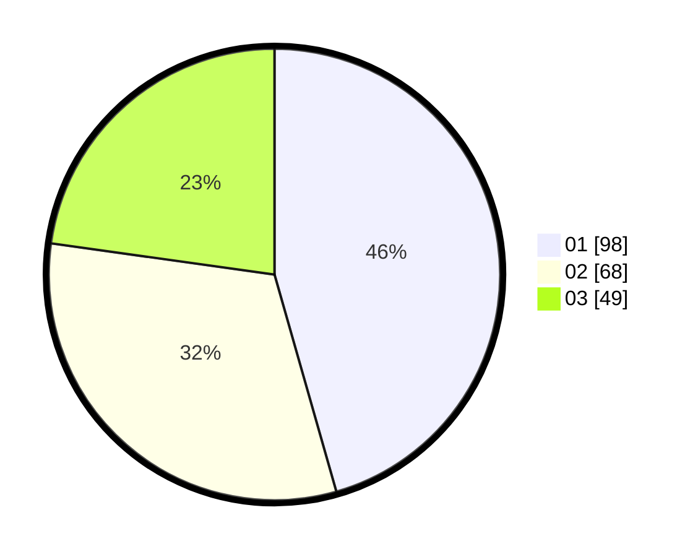

# Hasil

Hasil perolehan suara paslon dapat dilihat pada file paslon-01.txt, paslon-02.txt, dan paslon-03.txt.

Jika tidak ada, artinya data tersebut belum ada pada SIREKAP.

## Perolehan Suara

 * Paslon 01: **98**.
 * Paslon 02: **68**.
 * Paslon 03: **49**.

## Foto C Plano

https://sirekap-obj-formc.kpu.go.id/5adc/pemilu/ppwp/31/75/07/10/02/3175071002071-20240214-204445--674a8299-61f8-4988-9932-3c85ee513975.jpg

https://sirekap-obj-formc.kpu.go.id/5adc/pemilu/ppwp/31/75/07/10/02/3175071002071-20240214-204608--4653e5f9-07eb-41ee-a06a-c54588ee0110.jpg

https://sirekap-obj-formc.kpu.go.id/5adc/pemilu/ppwp/31/75/07/10/02/3175071002071-20240214-204723--93ffbc42-0f11-4b7c-ad64-5587aa4b1fbf.jpg
