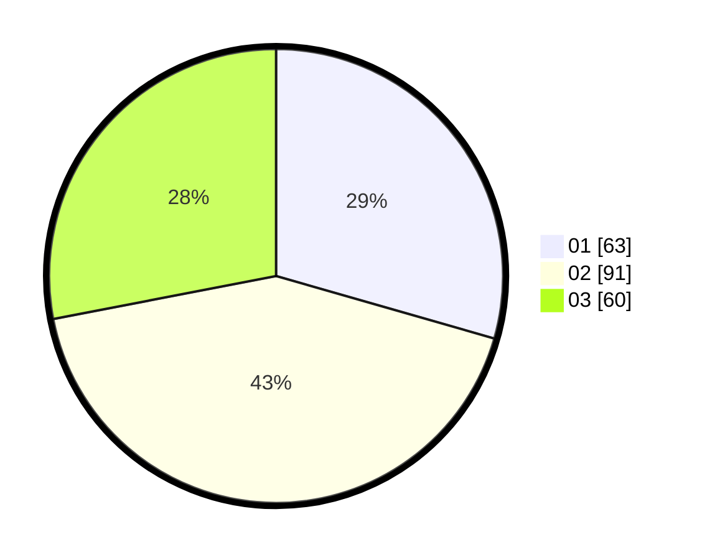

# Hasil

Hasil perolehan suara paslon dapat dilihat pada file paslon-01.txt, paslon-02.txt, dan paslon-03.txt.

Jika tidak ada, artinya data tersebut belum ada pada SIREKAP.

## Perolehan Suara

 * Paslon 01: **63**.
 * Paslon 02: **91**.
 * Paslon 03: **60**.

## Foto C Plano

https://sirekap-obj-formc.kpu.go.id/4ae6/pemilu/ppwp/31/75/07/10/02/3175071002075-20240215-004854--cfece606-29f7-47dc-9982-17765ef246b7.jpg

https://sirekap-obj-formc.kpu.go.id/4ae6/pemilu/ppwp/31/75/07/10/02/3175071002075-20240214-203823--a1ed10f8-4800-417f-ac97-ead17f82ab78.jpg

https://sirekap-obj-formc.kpu.go.id/4ae6/pemilu/ppwp/31/75/07/10/02/3175071002075-20240214-204131--eecbdbb3-1e29-4b6f-86fa-7e0f33a6d931.jpg
