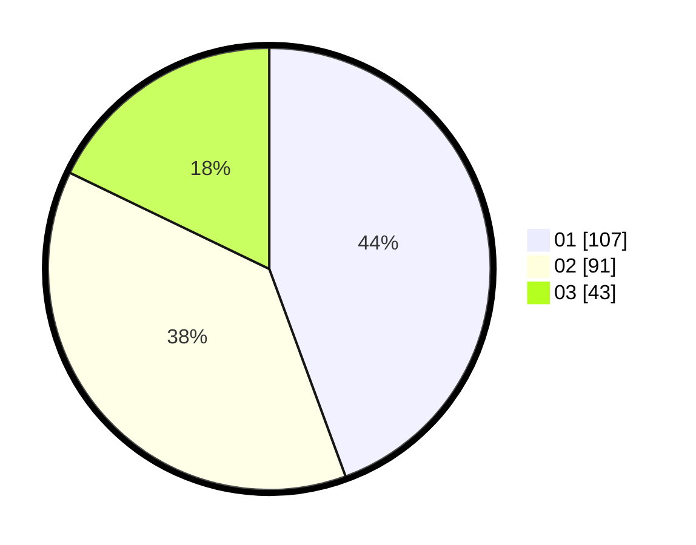

# Hasil

Hasil perolehan suara paslon dapat dilihat pada file paslon-01.txt, paslon-02.txt, dan paslon-03.txt.

Jika tidak ada, artinya data tersebut belum ada pada SIREKAP.

## Perolehan Suara

 * Paslon 01: **107**.
 * Paslon 02: **91**.
 * Paslon 03: **43**.

## Foto C Plano

https://sirekap-obj-formc.kpu.go.id/33d2/pemilu/ppwp/31/75/07/10/02/3175071002077-20240214-201430--5b8837df-d7b4-4ed7-890f-22c3f6a0a192.jpg

https://sirekap-obj-formc.kpu.go.id/33d2/pemilu/ppwp/31/75/07/10/02/3175071002077-20240214-194438--ad34bbb2-bbcd-476b-a695-d0ff3bce5a98.jpg

https://sirekap-obj-formc.kpu.go.id/33d2/pemilu/ppwp/31/75/07/10/02/3175071002077-20240214-192043--d3395a21-b936-48ff-a5cd-5b66238ffc8e.jpg

## DATA PEMILIH TETAP

Jumlah pemilih dalam DPT: **271**.
 * L: **125**.
 * P: **146**.

## DATA PENGGUNA HAK PILIH

Jumlah pengguna hak pilih dalam DPT: **236**.
 * L: **112**.
 * P: **124**.

Jumlah pengguna hak pilih dalam DPTb: **5**.
 * L: **2**.
 * P: **3**.

Jumlah pengguna hak pilih dalam DPK: **1**.
 * L: **0**.
 * P: **1**.

Jumlah pengguna hak pilih: **242**.
 * L: **114**.
 * P: **128**.

## JUMLAH SUARA SAH DAN TIDAK SAH

JUMLAH SELURUH SUARA SAH: **241**.

JUMLAH SUARA TIDAK SAH: **1**.

JUMLAH SELURUH SUARA SAH DAN SUARA TIDAK SAH: **242**.
