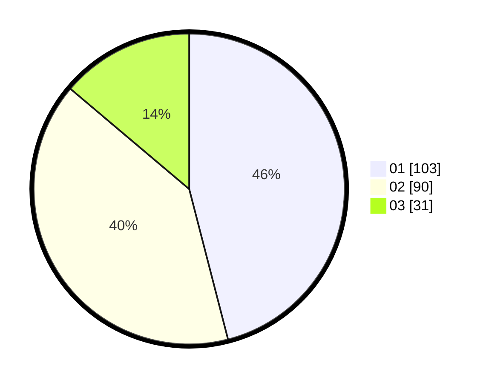

# Hasil

Hasil perolehan suara paslon dapat dilihat pada file paslon-01.txt, paslon-02.txt, dan paslon-03.txt.

Jika tidak ada, artinya data tersebut belum ada pada SIREKAP.

## Perolehan Suara

 * Paslon 01: **103**.
 * Paslon 02: **90**.
 * Paslon 03: **31**.

## Foto C Plano

https://sirekap-obj-formc.kpu.go.id/1401/pemilu/ppwp/31/75/07/10/02/3175071002085-20240216-015037--5ac404ac-5b52-461b-a3e5-ba975424d7df.jpg

https://sirekap-obj-formc.kpu.go.id/1401/pemilu/ppwp/31/75/07/10/02/3175071002085-20240216-015049--86f6ffa2-3d8f-49d2-8ec1-20bd2c7366d1.jpg

https://sirekap-obj-formc.kpu.go.id/1401/pemilu/ppwp/31/75/07/10/02/3175071002085-20240216-015043--bba97fe9-2c8f-4ea5-add7-9671d0564b67.jpg

## DATA PEMILIH TETAP

Jumlah pemilih dalam DPT: **273**.
 * L: **142**.
 * P: **131**.

## DATA PENGGUNA HAK PILIH

Jumlah pengguna hak pilih dalam DPT: **222**.
 * L: **115**.
 * P: **107**.

Jumlah pengguna hak pilih dalam DPTb: **0**.
 * L: **0**.
 * P: **0**.

Jumlah pengguna hak pilih dalam DPK: **4**.
 * L: **1**.
 * P: **3**.

Jumlah pengguna hak pilih: **226**.
 * L: **116**.
 * P: **110**.

## JUMLAH SUARA SAH DAN TIDAK SAH

JUMLAH SELURUH SUARA SAH: **224**.

JUMLAH SUARA TIDAK SAH: **2**.

JUMLAH SELURUH SUARA SAH DAN SUARA TIDAK SAH: **226**.
