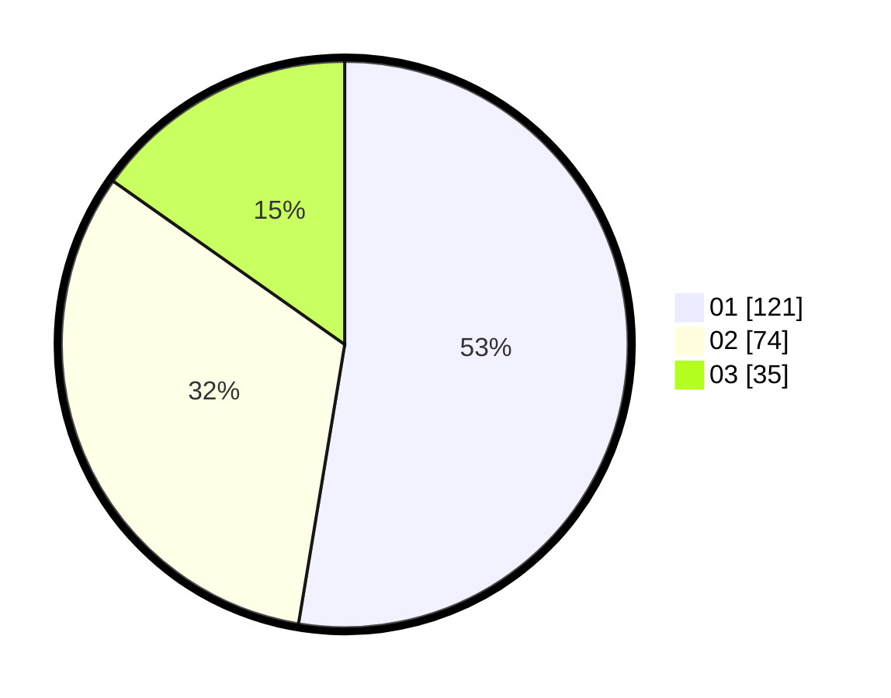

# Hasil

Hasil perolehan suara paslon dapat dilihat pada file paslon-01.txt, paslon-02.txt, dan paslon-03.txt.

Jika tidak ada, artinya data tersebut belum ada pada SIREKAP.

## Perolehan Suara

 * Paslon 01: **121**.
 * Paslon 02: **74**.
 * Paslon 03: **35**.

## Foto C Plano

https://sirekap-obj-formc.kpu.go.id/dea0/pemilu/ppwp/31/75/07/10/02/3175071002086-20240216-085620--e5579f19-d480-4613-b325-a036c7f47543.jpg

https://sirekap-obj-formc.kpu.go.id/dea0/pemilu/ppwp/31/75/07/10/02/3175071002086-20240216-143550--63314999-0c68-44ec-b542-46346373b222.jpg

https://sirekap-obj-formc.kpu.go.id/dea0/pemilu/ppwp/31/75/07/10/02/3175071002086-20240216-143550--88b08a72-5be3-4273-82b5-e7f89e4c7d18.jpg

## DATA PEMILIH TETAP

Jumlah pemilih dalam DPT: **294**.
 * L: **153**.
 * P: **141**.

## DATA PENGGUNA HAK PILIH

Jumlah pengguna hak pilih dalam DPT: **230**.
 * L: **114**.
 * P: **116**.

Jumlah pengguna hak pilih dalam DPTb: **0**.
 * L: **0**.
 * P: **0**.

Jumlah pengguna hak pilih dalam DPK: **2**.
 * L: **0**.
 * P: **2**.

Jumlah pengguna hak pilih: **232**.
 * L: **114**.
 * P: **118**.

## JUMLAH SUARA SAH DAN TIDAK SAH

JUMLAH SELURUH SUARA SAH: **230**.

JUMLAH SUARA TIDAK SAH: **2**.

JUMLAH SELURUH SUARA SAH DAN SUARA TIDAK SAH: **232**.
