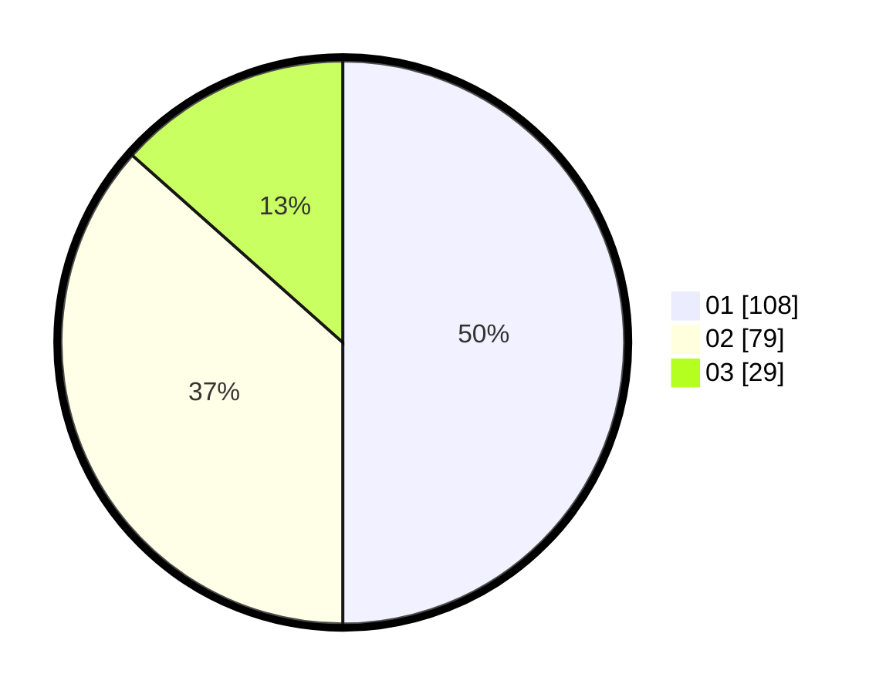

# Hasil

Hasil perolehan suara paslon dapat dilihat pada file paslon-01.txt, paslon-02.txt, dan paslon-03.txt.

Jika tidak ada, artinya data tersebut belum ada pada SIREKAP.

## Perolehan Suara

 * Paslon 01: **108**.
 * Paslon 02: **79**.
 * Paslon 03: **29**.

## Foto C Plano

https://sirekap-obj-formc.kpu.go.id/4410/pemilu/ppwp/31/75/07/10/02/3175071002087-20240216-150625--d5a50c0b-53b3-4b83-a613-c5d3bfce9236.jpg

https://sirekap-obj-formc.kpu.go.id/4410/pemilu/ppwp/31/75/07/10/02/3175071002087-20240216-150626--400a8e7e-185a-4839-b354-19c5d70d2cdf.jpg

https://sirekap-obj-formc.kpu.go.id/4410/pemilu/ppwp/31/75/07/10/02/3175071002087-20240216-150626--b7e3043b-9e9a-4239-bc8e-784f37bb8228.jpg

## DATA PEMILIH TETAP

Jumlah pemilih dalam DPT: **273**.
 * L: **136**.
 * P: **137**.

## DATA PENGGUNA HAK PILIH

Jumlah pengguna hak pilih dalam DPT: **212**.
 * L: **105**.
 * P: **107**.

Jumlah pengguna hak pilih dalam DPTb: **0**.
 * L: **0**.
 * P: **0**.

Jumlah pengguna hak pilih dalam DPK: **5**.
 * L: **3**.
 * P: **2**.

Jumlah pengguna hak pilih: **217**.
 * L: **108**.
 * P: **109**.

## JUMLAH SUARA SAH DAN TIDAK SAH

JUMLAH SELURUH SUARA SAH: **216**.

JUMLAH SUARA TIDAK SAH: **1**.

JUMLAH SELURUH SUARA SAH DAN SUARA TIDAK SAH: **217**.
