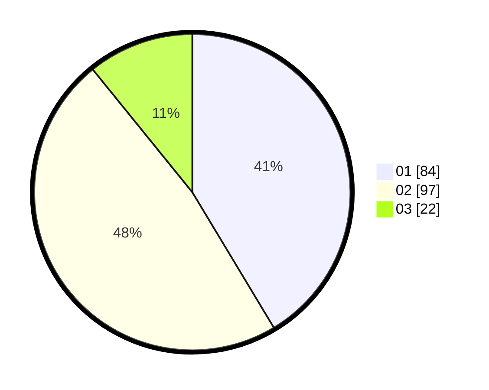

# Hasil

Hasil perolehan suara paslon dapat dilihat pada file paslon-01.txt, paslon-02.txt, dan paslon-03.txt.

Jika tidak ada, artinya data tersebut belum ada pada SIREKAP.

## Perolehan Suara

 * Paslon 01: **84**.
 * Paslon 02: **97**.
 * Paslon 03: **22**.

## Foto C Plano

https://sirekap-obj-formc.kpu.go.id/7533/pemilu/ppwp/31/75/07/10/02/3175071002092-20240216-143448--82eb368d-c82d-47f4-a3b1-e7a9f83fffa3.jpg

https://sirekap-obj-formc.kpu.go.id/7533/pemilu/ppwp/31/75/07/10/02/3175071002092-20240216-143449--5b4e9c71-b5c7-4d33-b984-15d4553988a8.jpg

https://sirekap-obj-formc.kpu.go.id/7533/pemilu/ppwp/31/75/07/10/02/3175071002092-20240216-143448--ea1e1863-08d0-44fa-a946-da74676c2749.jpg

## DATA PEMILIH TETAP

Jumlah pemilih dalam DPT: **263**.
 * L: **132**.
 * P: **131**.

## DATA PENGGUNA HAK PILIH

Jumlah pengguna hak pilih dalam DPT: **263**.
 * L: **132**.
 * P: **131**.

Jumlah pengguna hak pilih dalam DPTb: **0**.
 * L: **0**.
 * P: **0**.

Jumlah pengguna hak pilih dalam DPK: **0**.
 * L: **0**.
 * P: **0**.

Jumlah pengguna hak pilih: **263**.
 * L: **132**.
 * P: **131**.

## JUMLAH SUARA SAH DAN TIDAK SAH

JUMLAH SELURUH SUARA SAH: **203**.

JUMLAH SUARA TIDAK SAH: **1**.

JUMLAH SELURUH SUARA SAH DAN SUARA TIDAK SAH: **204**.
