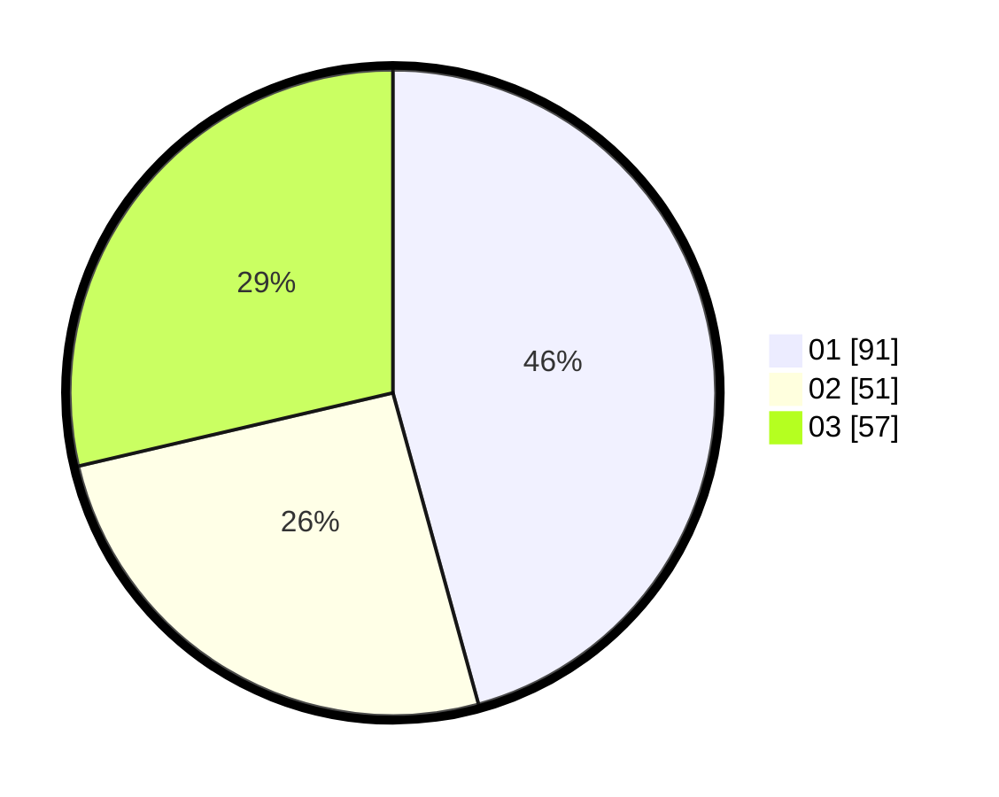

# Hasil

Hasil perolehan suara paslon dapat dilihat pada file paslon-01.txt, paslon-02.txt, dan paslon-03.txt.

Jika tidak ada, artinya data tersebut belum ada pada SIREKAP.

## Perolehan Suara

 * Paslon 01: **91**.
 * Paslon 02: **51**.
 * Paslon 03: **57**.

## Foto C Plano

https://sirekap-obj-formc.kpu.go.id/7ba2/pemilu/ppwp/31/75/07/10/02/3175071002094-20240214-155314--3c49c601-d670-45a2-9442-6416d9856124.jpg

https://sirekap-obj-formc.kpu.go.id/7ba2/pemilu/ppwp/31/75/07/10/02/3175071002094-20240214-191407--ebf27cee-5592-4172-9609-69d28cfc9d12.jpg

https://sirekap-obj-formc.kpu.go.id/7ba2/pemilu/ppwp/31/75/07/10/02/3175071002094-20240214-155532--ce809b7f-5cb7-4c85-a99f-58fc7b9c9518.jpg

## DATA PEMILIH TETAP

Jumlah pemilih dalam DPT: **255**.
 * L: **118**.
 * P: **137**.

## DATA PENGGUNA HAK PILIH

Jumlah pengguna hak pilih dalam DPT: **202**.
 * L: **94**.
 * P: **108**.

Jumlah pengguna hak pilih dalam DPTb: **0**.
 * L: **0**.
 * P: **0**.

Jumlah pengguna hak pilih dalam DPK: **2**.
 * L: **1**.
 * P: **1**.

Jumlah pengguna hak pilih: **204**.
 * L: **95**.
 * P: **109**.

## JUMLAH SUARA SAH DAN TIDAK SAH

JUMLAH SELURUH SUARA SAH: **199**.

JUMLAH SUARA TIDAK SAH: **5**.

JUMLAH SELURUH SUARA SAH DAN SUARA TIDAK SAH: **204**.
