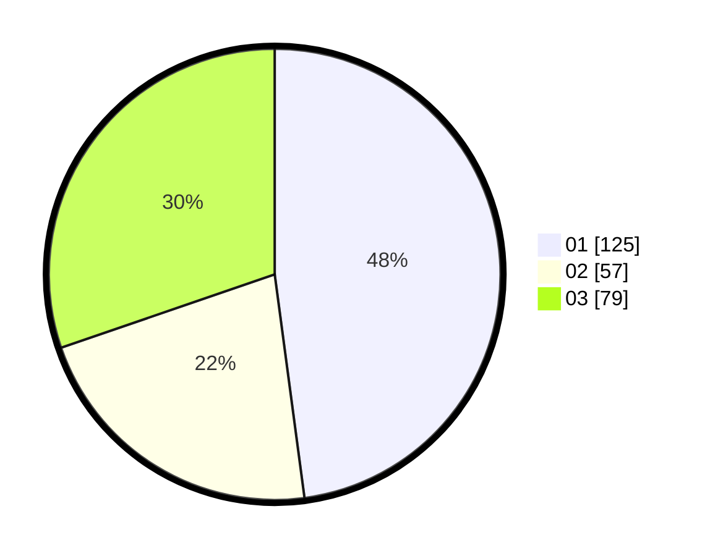

# Hasil

Hasil perolehan suara paslon dapat dilihat pada file paslon-01.txt, paslon-02.txt, dan paslon-03.txt.

Jika tidak ada, artinya data tersebut belum ada pada SIREKAP.

## Perolehan Suara

 * Paslon 01: **125**.
 * Paslon 02: **57**.
 * Paslon 03: **79**.

## Foto C Plano

https://sirekap-obj-formc.kpu.go.id/0434/pemilu/ppwp/31/75/07/10/02/3175071002100-20240216-100449--6494baab-8333-4eb2-822f-96a7aa477725.jpg

https://sirekap-obj-formc.kpu.go.id/0434/pemilu/ppwp/31/75/07/10/02/3175071002100-20240216-100513--ff7c87ae-9f4b-4d66-9a0c-34bcb6bb138a.jpg

https://sirekap-obj-formc.kpu.go.id/0434/pemilu/ppwp/31/75/07/10/02/3175071002100-20240216-100537--1a2797c4-608d-4d81-8385-fd1cb9ab4786.jpg

## DATA PEMILIH TETAP

Jumlah pemilih dalam DPT: **280**.
 * L: **132**.
 * P: **148**.

## DATA PENGGUNA HAK PILIH

Jumlah pengguna hak pilih dalam DPT: **241**.
 * L: **118**.
 * P: **123**.

Jumlah pengguna hak pilih dalam DPTb: **18**.
 * L: **7**.
 * P: **11**.

Jumlah pengguna hak pilih dalam DPK: **3**.
 * L: **1**.
 * P: **2**.

Jumlah pengguna hak pilih: **262**.
 * L: **126**.
 * P: **136**.

## JUMLAH SUARA SAH DAN TIDAK SAH

JUMLAH SELURUH SUARA SAH: **261**.

JUMLAH SUARA TIDAK SAH: **1**.

JUMLAH SELURUH SUARA SAH DAN SUARA TIDAK SAH: **262**.
