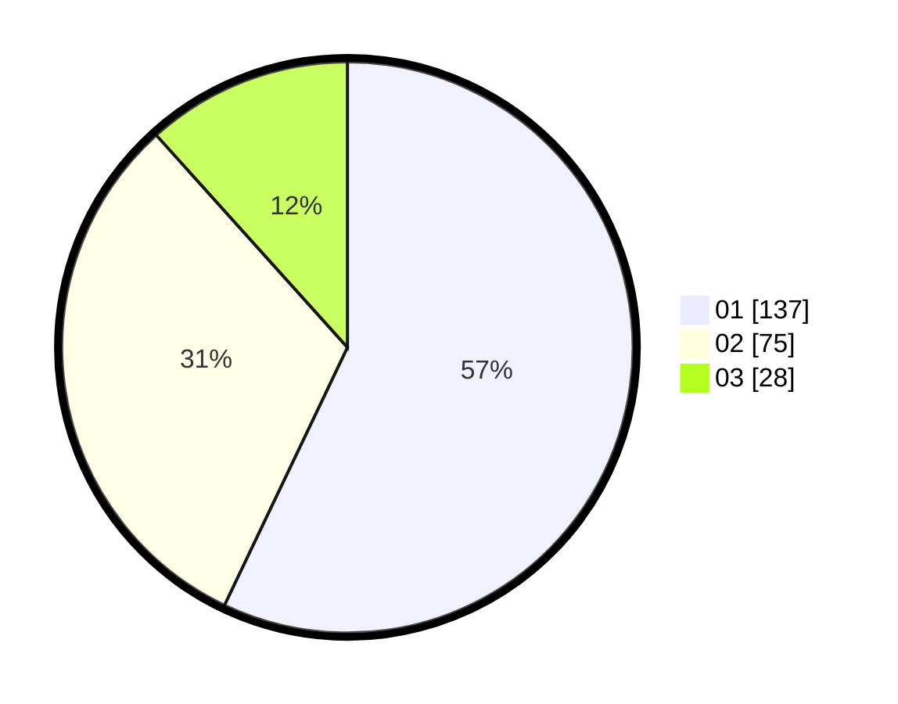

# Hasil

Hasil perolehan suara paslon dapat dilihat pada file paslon-01.txt, paslon-02.txt, dan paslon-03.txt.

Jika tidak ada, artinya data tersebut belum ada pada SIREKAP.

## Perolehan Suara

 * Paslon 01: **137**.
 * Paslon 02: **75**.
 * Paslon 03: **28**.

## Foto C Plano

https://sirekap-obj-formc.kpu.go.id/de75/pemilu/ppwp/31/75/07/10/02/3175071002101-20240214-213101--c88322ea-83e7-46b1-8496-19326b4e550d.jpg

https://sirekap-obj-formc.kpu.go.id/de75/pemilu/ppwp/31/75/07/10/02/3175071002101-20240214-212713--2ac6c5b1-eaa6-45dd-821f-2846ea6731f6.jpg

https://sirekap-obj-formc.kpu.go.id/de75/pemilu/ppwp/31/75/07/10/02/3175071002101-20240214-212733--21241704-0d09-406f-90da-8fea181c7297.jpg
