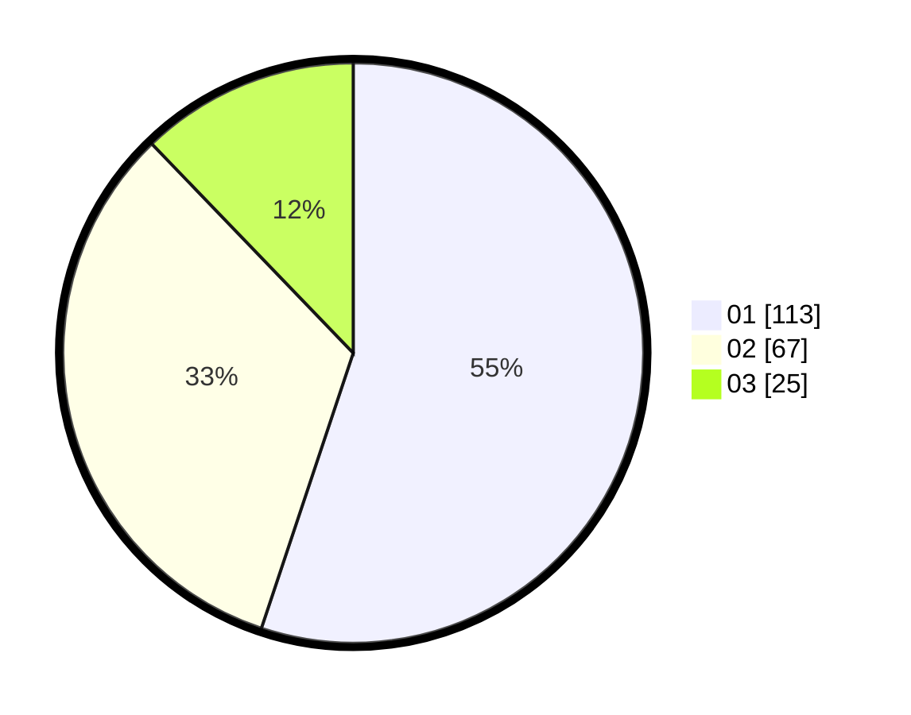

# Hasil

Hasil perolehan suara paslon dapat dilihat pada file paslon-01.txt, paslon-02.txt, dan paslon-03.txt.

Jika tidak ada, artinya data tersebut belum ada pada SIREKAP.

## Perolehan Suara

 * Paslon 01: **113**.
 * Paslon 02: **67**.
 * Paslon 03: **25**.

## Foto C Plano

https://sirekap-obj-formc.kpu.go.id/0171/pemilu/ppwp/31/75/07/10/02/3175071002108-20240214-184643--a24210a1-aa95-42b3-ad92-599475e3eb5c.jpg

https://sirekap-obj-formc.kpu.go.id/0171/pemilu/ppwp/31/75/07/10/02/3175071002108-20240214-184702--bc9eeee3-fc70-4b3f-b1ee-65ea4c256d64.jpg

https://sirekap-obj-formc.kpu.go.id/0171/pemilu/ppwp/31/75/07/10/02/3175071002108-20240214-190537--c96da6e1-0ea3-4e79-91c1-fca302ff3afe.jpg

## DATA PEMILIH TETAP

Jumlah pemilih dalam DPT: **259**.
 * L: **127**.
 * P: **132**.

## DATA PENGGUNA HAK PILIH

Jumlah pengguna hak pilih dalam DPT: **212**.
 * L: **104**.
 * P: **108**.

Jumlah pengguna hak pilih dalam DPTb: **0**.
 * L: **0**.
 * P: **0**.

Jumlah pengguna hak pilih dalam DPK: **1**.
 * L: **1**.
 * P: **0**.

Jumlah pengguna hak pilih: **213**.
 * L: **105**.
 * P: **108**.

## JUMLAH SUARA SAH DAN TIDAK SAH

JUMLAH SELURUH SUARA SAH: **205**.

JUMLAH SUARA TIDAK SAH: **8**.

JUMLAH SELURUH SUARA SAH DAN SUARA TIDAK SAH: **213**.
