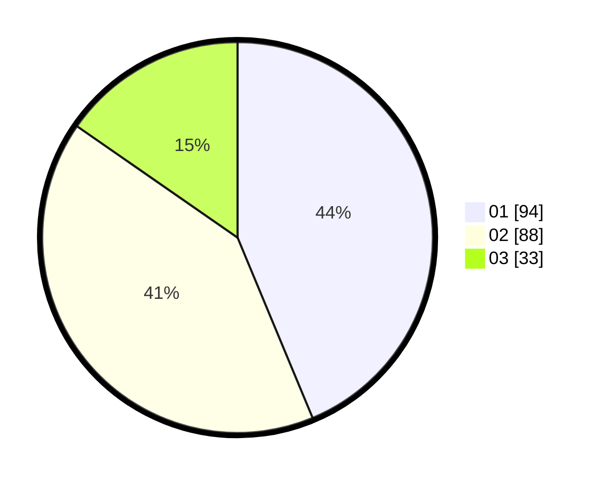

# Hasil

Hasil perolehan suara paslon dapat dilihat pada file paslon-01.txt, paslon-02.txt, dan paslon-03.txt.

Jika tidak ada, artinya data tersebut belum ada pada SIREKAP.

## Perolehan Suara

 * Paslon 01: **94**.
 * Paslon 02: **88**.
 * Paslon 03: **33**.

## Foto C Plano

https://sirekap-obj-formc.kpu.go.id/89c3/pemilu/ppwp/31/75/07/10/02/3175071002110-20240215-233025--c35a4322-6de9-4fe6-806d-e9dd694dd8b5.jpg

https://sirekap-obj-formc.kpu.go.id/89c3/pemilu/ppwp/31/75/07/10/02/3175071002110-20240215-234307--05c833ab-46b6-4c4d-83a7-568a44de50e7.jpg

https://sirekap-obj-formc.kpu.go.id/89c3/pemilu/ppwp/31/75/07/10/02/3175071002110-20240215-234814--9f08958b-8870-401d-be3c-794b849a1d07.jpg

## DATA PEMILIH TETAP

Jumlah pemilih dalam DPT: **263**.
 * L: **123**.
 * P: **140**.

## DATA PENGGUNA HAK PILIH

Jumlah pengguna hak pilih dalam DPT: **213**.
 * L: **102**.
 * P: **111**.

Jumlah pengguna hak pilih dalam DPTb: **0**.
 * L: **0**.
 * P: **0**.

Jumlah pengguna hak pilih dalam DPK: **3**.
 * L: **2**.
 * P: **1**.

Jumlah pengguna hak pilih: **216**.
 * L: **104**.
 * P: **112**.

## JUMLAH SUARA SAH DAN TIDAK SAH

JUMLAH SELURUH SUARA SAH: **215**.

JUMLAH SUARA TIDAK SAH: **1**.

JUMLAH SELURUH SUARA SAH DAN SUARA TIDAK SAH: **216**.
