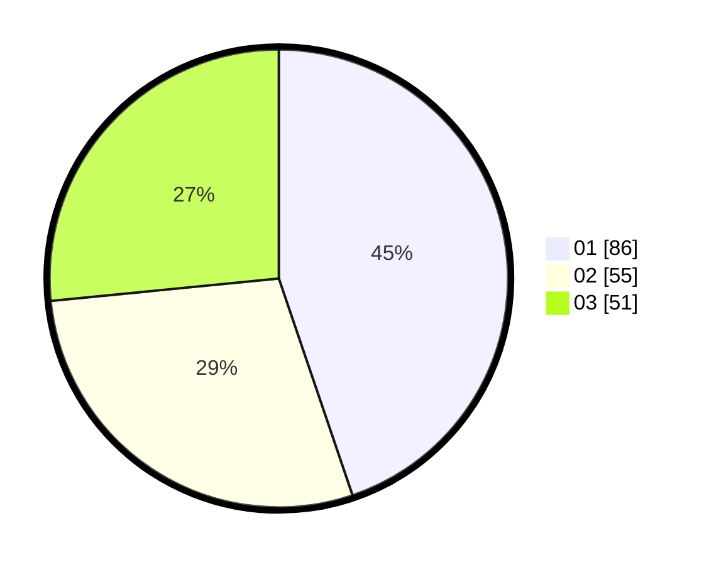

# Hasil

Hasil perolehan suara paslon dapat dilihat pada file paslon-01.txt, paslon-02.txt, dan paslon-03.txt.

Jika tidak ada, artinya data tersebut belum ada pada SIREKAP.

## Perolehan Suara

 * Paslon 01: **86**.
 * Paslon 02: **55**.
 * Paslon 03: **51**.

## Foto C Plano

https://sirekap-obj-formc.kpu.go.id/0993/pemilu/ppwp/31/75/07/10/02/3175071002113-20240214-155153--d5adab71-04d8-4830-bfad-c1521e9553ee.jpg

https://sirekap-obj-formc.kpu.go.id/0993/pemilu/ppwp/31/75/07/10/02/3175071002113-20240214-190230--0fe30253-0f86-41d2-8504-5050023514ff.jpg

https://sirekap-obj-formc.kpu.go.id/0993/pemilu/ppwp/31/75/07/10/02/3175071002113-20240214-190249--9a528785-26a1-4a89-a27a-1830bbe20fa9.jpg

## DATA PEMILIH TETAP

Jumlah pemilih dalam DPT: **238**.
 * L: **110**.
 * P: **128**.

## DATA PENGGUNA HAK PILIH

Jumlah pengguna hak pilih dalam DPT: **192**.
 * L: **86**.
 * P: **106**.

Jumlah pengguna hak pilih dalam DPTb: **2**.
 * L: **1**.
 * P: **1**.

Jumlah pengguna hak pilih dalam DPK: **1**.
 * L: **1**.
 * P: **0**.

Jumlah pengguna hak pilih: **195**.
 * L: **88**.
 * P: **107**.

## JUMLAH SUARA SAH DAN TIDAK SAH

JUMLAH SELURUH SUARA SAH: **192**.

JUMLAH SUARA TIDAK SAH: **3**.

JUMLAH SELURUH SUARA SAH DAN SUARA TIDAK SAH: **195**.
