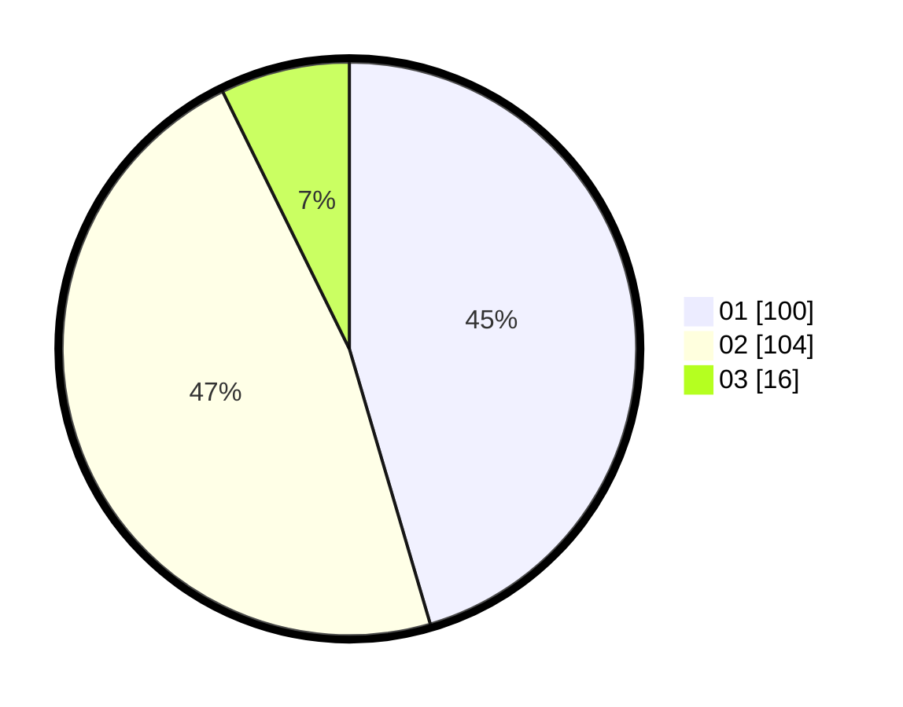

# Hasil

Hasil perolehan suara paslon dapat dilihat pada file paslon-01.txt, paslon-02.txt, dan paslon-03.txt.

Jika tidak ada, artinya data tersebut belum ada pada SIREKAP.

## Perolehan Suara

 * Paslon 01: **100**.
 * Paslon 02: **104**.
 * Paslon 03: **16**.

## Foto C Plano

https://sirekap-obj-formc.kpu.go.id/a3c4/pemilu/ppwp/31/75/07/10/02/3175071002115-20240215-000357--6a87b197-8d63-49bb-ab75-501d52d13d07.jpg

https://sirekap-obj-formc.kpu.go.id/a3c4/pemilu/ppwp/31/75/07/10/02/3175071002115-20240215-234320--a18e5dc5-2782-45ac-9092-9946c1d036db.jpg

https://sirekap-obj-formc.kpu.go.id/a3c4/pemilu/ppwp/31/75/07/10/02/3175071002115-20240215-000748--851e7218-25e1-4b40-9bcc-ea7ebb5b9a41.jpg

## DATA PEMILIH TETAP

Jumlah pemilih dalam DPT: **264**.
 * L: **131**.
 * P: **133**.

## DATA PENGGUNA HAK PILIH

Jumlah pengguna hak pilih dalam DPT: **214**.
 * L: **103**.
 * P: **111**.

Jumlah pengguna hak pilih dalam DPTb: **3**.
 * L: **2**.
 * P: **1**.

Jumlah pengguna hak pilih dalam DPK: **5**.
 * L: **1**.
 * P: **4**.

Jumlah pengguna hak pilih: **222**.
 * L: **106**.
 * P: **116**.

## JUMLAH SUARA SAH DAN TIDAK SAH

JUMLAH SELURUH SUARA SAH: **220**.

JUMLAH SUARA TIDAK SAH: **2**.

JUMLAH SELURUH SUARA SAH DAN SUARA TIDAK SAH: **222**.
