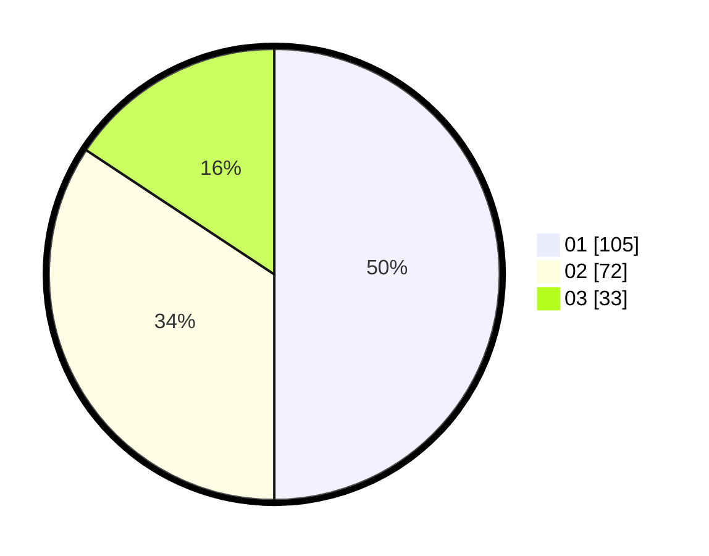

# Hasil

Hasil perolehan suara paslon dapat dilihat pada file paslon-01.txt, paslon-02.txt, dan paslon-03.txt.

Jika tidak ada, artinya data tersebut belum ada pada SIREKAP.

## Perolehan Suara

 * Paslon 01: **105**.
 * Paslon 02: **72**.
 * Paslon 03: **33**.

## Foto C Plano

https://sirekap-obj-formc.kpu.go.id/aa89/pemilu/ppwp/31/75/07/10/02/3175071002116-20240214-224430--9da8908d-666e-4b7c-941e-9eb66fc87d0a.jpg

https://sirekap-obj-formc.kpu.go.id/aa89/pemilu/ppwp/31/75/07/10/02/3175071002116-20240216-225146--7bec8898-2d5f-42cc-840b-463652409a74.jpg

https://sirekap-obj-formc.kpu.go.id/aa89/pemilu/ppwp/31/75/07/10/02/3175071002116-20240214-224850--915cfbc6-e450-442d-b77e-e9415f0898e9.jpg

## DATA PEMILIH TETAP

Jumlah pemilih dalam DPT: **261**.
 * L: **128**.
 * P: **133**.

## DATA PENGGUNA HAK PILIH

Jumlah pengguna hak pilih dalam DPT: **208**.
 * L: **95**.
 * P: **113**.

Jumlah pengguna hak pilih dalam DPTb: **1**.
 * L: **1**.
 * P: **0**.

Jumlah pengguna hak pilih dalam DPK: **1**.
 * L: **1**.
 * P: **0**.

Jumlah pengguna hak pilih: **210**.
 * L: **97**.
 * P: **113**.

## JUMLAH SUARA SAH DAN TIDAK SAH

JUMLAH SELURUH SUARA SAH: **210**.

JUMLAH SUARA TIDAK SAH: **0**.

JUMLAH SELURUH SUARA SAH DAN SUARA TIDAK SAH: **210**.
