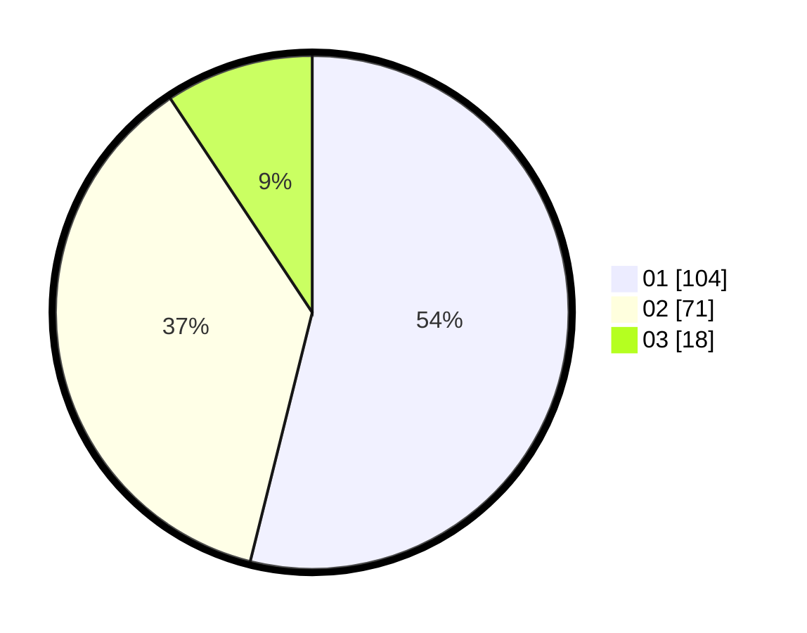

# Hasil

Hasil perolehan suara paslon dapat dilihat pada file paslon-01.txt, paslon-02.txt, dan paslon-03.txt.

Jika tidak ada, artinya data tersebut belum ada pada SIREKAP.

## Perolehan Suara

 * Paslon 01: **104**.
 * Paslon 02: **71**.
 * Paslon 03: **18**.

## Foto C Plano

https://sirekap-obj-formc.kpu.go.id/9701/pemilu/ppwp/31/75/07/10/02/3175071002117-20240216-233818--e3f20dc0-4cb9-408e-8070-76ea1a80a3ea.jpg

https://sirekap-obj-formc.kpu.go.id/9701/pemilu/ppwp/31/75/07/10/02/3175071002117-20240216-233929--5b39c0d1-5263-481b-a974-4b85bf2e6bc4.jpg

https://sirekap-obj-formc.kpu.go.id/9701/pemilu/ppwp/31/75/07/10/02/3175071002117-20240216-234025--6817c804-cda9-4b5e-ac0b-a0dfb7672752.jpg

## DATA PEMILIH TETAP

Jumlah pemilih dalam DPT: **253**.
 * L: **134**.
 * P: **119**.

## DATA PENGGUNA HAK PILIH

Jumlah pengguna hak pilih dalam DPT: **194**.
 * L: **98**.
 * P: **96**.

Jumlah pengguna hak pilih dalam DPTb: **0**.
 * L: **0**.
 * P: **0**.

Jumlah pengguna hak pilih dalam DPK: **0**.
 * L: **0**.
 * P: **0**.

Jumlah pengguna hak pilih: **194**.
 * L: **98**.
 * P: **96**.

## JUMLAH SUARA SAH DAN TIDAK SAH

JUMLAH SELURUH SUARA SAH: **193**.

JUMLAH SUARA TIDAK SAH: **1**.

JUMLAH SELURUH SUARA SAH DAN SUARA TIDAK SAH: **194**.
