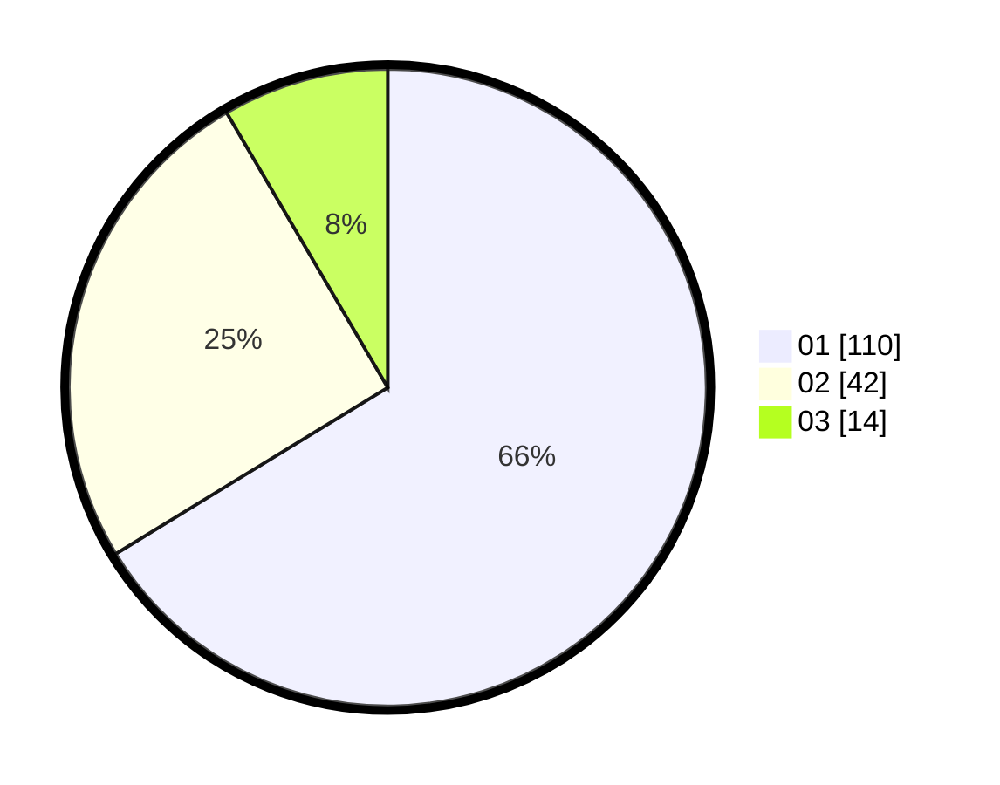

# Hasil

Hasil perolehan suara paslon dapat dilihat pada file paslon-01.txt, paslon-02.txt, dan paslon-03.txt.

Jika tidak ada, artinya data tersebut belum ada pada SIREKAP.

## Perolehan Suara

 * Paslon 01: **110**.
 * Paslon 02: **42**.
 * Paslon 03: **14**.

## Foto C Plano

https://sirekap-obj-formc.kpu.go.id/710c/pemilu/ppwp/31/75/07/10/02/3175071002118-20240214-200747--75623ad8-e0fb-4ad9-90e4-3df75191f7e3.jpg

https://sirekap-obj-formc.kpu.go.id/710c/pemilu/ppwp/31/75/07/10/02/3175071002118-20240214-213908--046238b4-1c80-47c8-b717-7281cd3eeb3b.jpg

https://sirekap-obj-formc.kpu.go.id/710c/pemilu/ppwp/31/75/07/10/02/3175071002118-20240214-201010--155275e7-4c74-4f78-888b-43b058bbe50c.jpg

## DATA PEMILIH TETAP

Jumlah pemilih dalam DPT: **261**.
 * L: **126**.
 * P: **135**.

## DATA PENGGUNA HAK PILIH

Jumlah pengguna hak pilih dalam DPT: **214**.
 * L: **99**.
 * P: **115**.

Jumlah pengguna hak pilih dalam DPTb: **0**.
 * L: **0**.
 * P: **0**.

Jumlah pengguna hak pilih dalam DPK: **3**.
 * L: **0**.
 * P: **3**.

Jumlah pengguna hak pilih: **217**.
 * L: **99**.
 * P: **118**.

## JUMLAH SUARA SAH DAN TIDAK SAH

JUMLAH SELURUH SUARA SAH: **216**.

JUMLAH SUARA TIDAK SAH: **0**.

JUMLAH SELURUH SUARA SAH DAN SUARA TIDAK SAH: **216**.
